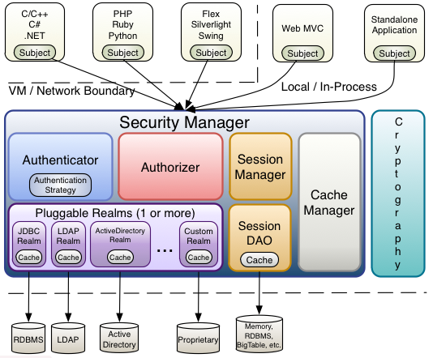

# Shiro简介
Apache Shiro是一个强大且易用的Java安全框架，它可以完成诸如：身份认证、授权、加密、会话管理等功能，并且可以很方便地与Web 集成或者使用缓存。使用Shiro易于理解的API，你可以快速、轻松地获得任何应用程序，从最小的移动应用程序到最大的网络和企业应用程序。

Shiro官网：<http://shiro.apache.org/>

# Shiro的架构
从顶层概念设计层面来看，Shiro架构包含有3个很重要的元素：Subject，SecurityManager 和 Realms。

- Subject： Subject 代表了当前执行操作的“用户”，这个用户可以是一个具体的人，也可以是一个第三方服务、一个守护进程、一个Cron定时任务、一个网络爬虫、亦或者是类似这些的与你的应用程序交互的其他任何事物。每一个 Subject 都会绑定一个SecurityManager ，与 Subject 的所有交互最终都会转交给 SecurityManager 来处理；
- SecurityManager：安全管理器是Shiro架构的核心，它负责协调 Shiro 内部的其他安全组件一起顺利工作。需要注意的是，虽然在我们的应用程序代码中大部分都是调用的Subject的API，但是后台实际上主要是SecurityManager在完成这些安全操作。
- Realm：Shiro 从 Realm 获取安全数据（如用户、角色、权限），就是说 SecurityManager 要进行身份验证（登录）或者授权（访问控制），它需要从 Realm 获取相应用户的安全数据，我们可以把 Realm 看成是存储了用户安全数据的数据源。

下图展示了Shiro内部的详细架构。

- Subject (org.apache.shiro.subject.Subject)

代表当前执行操作的“用户”。

- SecurityManager (org.apache.shiro.mgt.SecurityManager)

安全管理器是Shiro架构的核心，它负责协调 Shiro 内部的其他安全组件一起顺利工作。

- Authenticator (org.apache.shiro.authc.Authenticator)

身份验证/登录，在用户登录时，对用户的身份进行验证。

- Authorizer (org.apache.shiro.authz.Authorizer)

授权/访问控制，验证某个已认证的用户是否拥有执行某个操作的权限。

- SessionManager (org.apache.shiro.session.mgt.SessionManager)

会话管理，创建和管理用户 session 的生命周期。

- CacheManager (org.apache.shiro.cache.CacheManager)

缓存管理，创建和管理缓存实例的生命周期供Shiro其他组件使用，提升性能。

- Cryptography (org.apache.shiro.crypto.*)

加密，Shiro提供了一些简单易用的加解密算法。

- Realms (org.apache.shiro.realm.Realm)

Shiro 需要从 Realm 获取安全数据（如用户、角色、权限）。

# 快速开始
在Shiro源码包中有一个快速开始示例。

源码下载：<http://archive.apache.org/dist/shiro/>

`samples/quickstart/src/main/java/Quickstart.java`，示例代码如下：

	package shiro_test;
	 
	import org.apache.shiro.SecurityUtils;
	import org.apache.shiro.authc.*;
	import org.apache.shiro.config.IniSecurityManagerFactory;
	import org.apache.shiro.mgt.SecurityManager;
	import org.apache.shiro.session.Session;
	import org.apache.shiro.subject.Subject;
	import org.apache.shiro.util.Factory;
	import org.slf4j.Logger;
	import org.slf4j.LoggerFactory;
	 
	public class Quickstart {
	 
		private static final transient Logger log = LoggerFactory.getLogger(Quickstart.class);
	 
		public static void main(String[] args) {
	 
			// 通过加载 classpath 下的 shiro.ini 文件创建一个 factory，并通过该 factory 来获取一个 SecurityManager 实例
			Factory<SecurityManager> factory = new IniSecurityManagerFactory("classpath:shiro.ini");
			SecurityManager securityManager = factory.getInstance();
	 
			SecurityUtils.setSecurityManager(securityManager);
	 
			// 获取当前用户
			Subject currentUser = SecurityUtils.getSubject();
	 
			// 在 Session 中做一些事情（不需要Web或EJB容器！！！！）
			Session session = currentUser.getSession();
			session.setAttribute("someKey", "aValue");
			String value = (String) session.getAttribute("someKey");
			if (value.equals("aValue")) {
				log.info("Retrieved the correct value! [" + value + "]");
			}
	 
			/**
			 * 登录用户，以便检查用户的角色和权限
			 */
			// 判断是否已经验证身份，即是否已经登录
			if (!currentUser.isAuthenticated()) {
				// 将用户名和密码封装成 UsernamePasswordToken 对象
				UsernamePasswordToken token = new UsernamePasswordToken("lonestarr", "vespa");
				// 记住我
				token.setRememberMe(true);
				try {
					currentUser.login(token);
					// 账号不存在
				} catch (UnknownAccountException uae) {
					log.info("There is no user with username of " + token.getPrincipal());
					// 账号与密码不匹配
				} catch (IncorrectCredentialsException ice) {
					log.info("Password for account " + token.getPrincipal() + " was incorrect!");
					// 账号已被锁定
				} catch (LockedAccountException lae) {
					log.info("The account for username " + token.getPrincipal() + " is locked.  "
							+ "Please contact your administrator to unlock it.");
				}
				// 其他身份验证异常
				catch (AuthenticationException ae) {
				}
			}
	 
			// 登录成功，打印出用户名
			log.info("User [" + currentUser.getPrincipal() + "] logged in successfully.");
	 
			// 检查用户的角色
			if (currentUser.hasRole("schwartz")) {
				log.info("May the Schwartz be with you!");
			} else {
				log.info("Hello, mere mortal.");
			}
	 
			// 检查用户的权限（非实例级别）
			if (currentUser.isPermitted("lightsaber:wield")) {
				log.info("You may use a lightsaber ring.  Use it wisely.");
			} else {
				log.info("Sorry, lightsaber rings are for schwartz masters only.");
			}
	 
			// 检查用户的权限（实例级别）
			if (currentUser.isPermitted("winnebago:drive:eagle5")) {
				log.info("You are permitted to 'drive' the winnebago with license plate (id) 'eagle5'.  "
						+ "Here are the keys - have fun!");
			} else {
				log.info("Sorry, you aren't allowed to drive the 'eagle5' winnebago!");
			}
	 
			// 任务完成，退出登录
			currentUser.logout();
	 
			System.exit(0);
		}
	}

身份验证相关的异常类的继承关系如下图所示：

示例的 shiro.ini 配置文件内容如下：

	# -----------------------------------------------------------------------------
	# Users and their assigned roles
	#
	# Each line conforms to the format defined in the
	# org.apache.shiro.realm.text.TextConfigurationRealm#setUserDefinitions JavaDoc
	# -----------------------------------------------------------------------------
	[users]
	# user 'root' with password 'secret' and the 'admin' role
	root = secret, admin
	# user 'guest' with the password 'guest' and the 'guest' role
	guest = guest, guest
	# user 'presidentskroob' with password '12345' ("That's the same combination on
	# my luggage!!!" ;)), and role 'president'
	presidentskroob = 12345, president
	# user 'darkhelmet' with password 'ludicrousspeed' and roles 'darklord' and 'schwartz'
	darkhelmet = ludicrousspeed, darklord, schwartz
	# user 'lonestarr' with password 'vespa' and roles 'goodguy' and 'schwartz'
	lonestarr = vespa, goodguy, schwartz
	 
	# -----------------------------------------------------------------------------
	# Roles with assigned permissions
	# 
	# Each line conforms to the format defined in the
	# org.apache.shiro.realm.text.TextConfigurationRealm#setRoleDefinitions JavaDoc
	# -----------------------------------------------------------------------------
	[roles]
	# 'admin' role has all permissions, indicated by the wildcard '*'
	admin = *
	# The 'schwartz' role can do anything (*) with any lightsaber:
	schwartz = lightsaber:*
	# The 'goodguy' role is allowed to 'drive' (action) the winnebago (type) with
	# license plate 'eagle5' (instance specific id)
	goodguy = winnebago:drive:eagle5

运行示例程序，控制台日志内容如下：
	
	2019-06-27 14:35:34,095 INFO [org.apache.shiro.session.mgt.AbstractValidatingSessionManager] - Enabling session validation scheduler... 
	2019-06-27 14:35:34,176 INFO [shiro_test.Quickstart] - Retrieved the correct value! [aValue] 
	2019-06-27 14:35:34,177 INFO [shiro_test.Quickstart] - User [lonestarr] logged in successfully. 
	2019-06-27 14:35:34,177 INFO [shiro_test.Quickstart] - May the Schwartz be with you! 
	2019-06-27 14:35:34,178 INFO [shiro_test.Quickstart] - You may use a lightsaber ring.  Use it wisely. 
	2019-06-27 14:35:34,178 INFO [shiro_test.Quickstart] - You are permitted to 'drive' the winnebago with license plate (id) 'eagle5'.  Here are the keys - have fun! 
	 