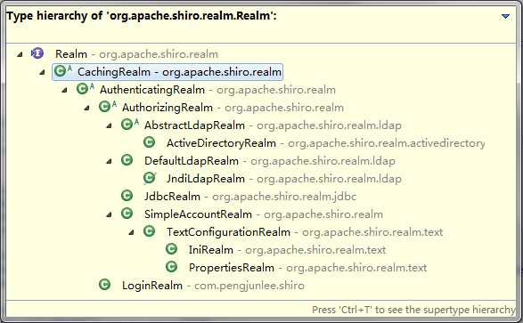

本章将在上一章《Shiro步步为营--开启身份验证》的基础上，对项目代码进行改造，演示如何开启Shiro权限验证。

# 开启权限验证
## 修改Realm 

同时开启身份验证和权限验证，需要对 Realm 进行修改，使其继承 AuthorizingRealm ，从上面的继承关系不难看出 AuthorizingRealm 也继承自 AuthenticatingRealm ，但 AuthorizingRealm 并未实现 AuthenticatingRealm 的 doGetAuthenticationInfo() 方法。所以，新的 Realm 需要同时实现 doGetAuthenticationInfo()和 doGetAuthorizationInfo 两个抽象方法。

	import java.util.HashMap;
	import java.util.HashSet;
	import java.util.Map;
	import java.util.Set;
	 
	import org.apache.shiro.SecurityUtils;
	import org.apache.shiro.authc.AuthenticationException;
	import org.apache.shiro.authc.AuthenticationInfo;
	import org.apache.shiro.authc.AuthenticationToken;
	import org.apache.shiro.authc.LockedAccountException;
	import org.apache.shiro.authc.SimpleAuthenticationInfo;
	import org.apache.shiro.authc.UnknownAccountException;
	import org.apache.shiro.authz.AuthorizationInfo;
	import org.apache.shiro.authz.SimpleAuthorizationInfo;
	import org.apache.shiro.realm.AuthorizingRealm;
	import org.apache.shiro.subject.PrincipalCollection;
	import org.apache.shiro.util.ByteSource;
	 
	import com.pengjunlee.domain.UserEntity;
	 
	/**
	 * 同时开启身份验证和权限验证，需要继承 AuthorizingRealm 
	 * 并实现其  doGetAuthenticationInfo()和 doGetAuthorizationInfo 两个方法
	 */
	@SuppressWarnings("serial")
	public class UserRealm extends AuthorizingRealm {
	 
		private static Map<String, UserEntity> userMap = new HashMap<String, UserEntity>(16);
		private static Map<String, Set<String>> roleMap = new HashMap<String, Set<String>>(16);
		private static Map<String, Set<String>> permMap = new HashMap<String, Set<String>>(16);
	 
		static {
			UserEntity user1 = new UserEntity(1L, "graython", "dd524c4c66076d1fa07e1fa1c94a91233772d132", "灰先生", false);
			UserEntity user2 = new UserEntity(2L, "plum", "cce369436bbb9f0325689a3a6d5d6b9b8a3f39a0", "李先生", false);
	 
			userMap.put("graython", user1);
			userMap.put("plum", user2);
	 
			roleMap.put("graython", new HashSet<String>() {
				{
					add("admin");
	 
				}
			});
			
			roleMap.put("plum", new HashSet<String>() {
				{
					add("guest");
				}
			});
			permMap.put("plum", new HashSet<String>() {
				{
					add("article:read");
				}
			});
		}
	 
		/**
		 * 查询数据库，将获取到的用户安全数据封装返回
		 */
		@Override
		protected AuthenticationInfo doGetAuthenticationInfo(AuthenticationToken token) throws AuthenticationException {
			// 从 AuthenticationToken 中获取当前用户
			String username = (String) token.getPrincipal();
			// 查询数据库获取用户信息，此处使用 Map 来模拟数据库
			UserEntity user = userMap.get(username);
	 
			// 用户不存在
			if (user == null) {
				throw new UnknownAccountException("用户不存在！");
			}
	 
			// 用户被锁定
			if (user.getLocked()) {
				throw new LockedAccountException("该用户已被锁定,暂时无法登录！");
			}
	 
			/**
			 * 将获取到的用户数据封装成 AuthenticationInfo 对象返回，此处封装为 SimpleAuthenticationInfo 对象。 
			 * 参数1. 认证的实体信息，可以是从数据库中获取到的用户实体类对象或者用户名 
			 * 参数2. 查询获取到的登录密码 
			 * 参数3. 当前 Realm 对象的名称，直接调用父类的 getName() 方法即可
			 */
			// SimpleAuthenticationInfo info = new SimpleAuthenticationInfo(user, user.getPassword(), getName());
	 
			// 使用用户名作为盐值
			ByteSource credentialsSalt = ByteSource.Util.bytes(username);
	 
			/**
			 * 将获取到的用户数据封装成 AuthenticationInfo 对象返回，此处封装为 SimpleAuthenticationInfo 对象。
			 *  参数1. 认证的实体信息，可以是从数据库中获取到的用户实体类对象或者用户名 
			 *  参数2. 查询获取到的登录密码 
			 *  参数3. 盐值
			 *  参数4. 当前 Realm 对象的名称，直接调用父类的 getName() 方法即可
			 */
			SimpleAuthenticationInfo info = new SimpleAuthenticationInfo(user, user.getPassword(), credentialsSalt,
					getName());
			return info;
		}
	 
		/**
		 * 查询数据库，将获取到的用户的角色及权限信息返回
		 */
		@Override
		protected AuthorizationInfo doGetAuthorizationInfo(PrincipalCollection principals) {
			// 获取当前用户
			UserEntity currentUser = (UserEntity) SecurityUtils.getSubject().getPrincipal();
			// UserEntity currentUser = (UserEntity)principals.getPrimaryPrincipal();
			// 查询数据库，获取用户的角色信息
			Set<String> roles = roleMap.get(currentUser.getName());
			// 查询数据库，获取用户的权限信息
			Set<String> perms = permMap.get(currentUser.getName());
	 
			SimpleAuthorizationInfo info = new SimpleAuthorizationInfo();
			info.setRoles(roles);
			info.setStringPermissions(perms);
			return info;
		}
	 
	}

在这个 Realm 中我们定义了两个用户：graython 具有 admin 角色，plum 具有 guest 角色和 article:read 权限。

## 新建Controller
新建一个 Controller 通过编码方式分别对角色和权限验证进行演示。 

	import org.apache.shiro.SecurityUtils;
	import org.apache.shiro.subject.Subject;
	import org.springframework.ui.ModelMap;
	import org.springframework.web.bind.annotation.GetMapping;
	import org.springframework.web.bind.annotation.RequestMapping;
	import org.springframework.web.bind.annotation.RestController;
	 
	@RestController
	@RequestMapping("/article")
	public class ArticleController {
	 
		@GetMapping("/delete")
		public String deleteArticle(ModelMap model) {
			// 获取当前用户
			Subject currentUser = SecurityUtils.getSubject();
			// 检查用户的角色
			if (currentUser.hasRole("admin")) {
				return "文章删除成功！";
			}
			return "尚未开通文章删除权限！";
		}
	 
		@GetMapping("/read")
		public String readArticle(ModelMap model) {
			// 获取当前用户
			Subject currentUser = SecurityUtils.getSubject();
			// 检查用户的权限
			if (currentUser.isPermitted("article:read")) {
				return "请您鉴赏！";
			}
			return "尚未开通文章阅读权限！";
		}
	 
	}

## 授权测试
使用graython账号登录，不具备文章阅读权限，但可以删除文章。

使用plum账号登录，不具备文章删除权限，但可以阅读文章。

# 开启Shiro标签支持
## 添加依赖
	<dependency>
		<groupId>org.thymeleaf</groupId>
		<artifactId>thymeleaf-spring4</artifactId>
		<version>3.0.11.RELEASE</version>
	</dependency>
	<dependency>
		<groupId>com.github.theborakompanioni</groupId>
		<artifactId>thymeleaf-extras-shiro</artifactId>
		<version>2.0.0</version>
	</dependency>
## 注入Bean
	/**
	 * ShiroDialect 是为了在thymeleaf里使用shiro标签的bean
	 */
	@Bean
	public ShiroDialect shiroDialect() {
		return new ShiroDialect();
	}
## Shiro标签
	guest标签
	　　<shiro:guest>
	　　</shiro:guest>
	　　用户没有身份验证时显示相应信息，即游客访问信息。
	 
	user标签
	　　<shiro:user>　　
	　　</shiro:user>
	　　用户已经身份验证/记住我登录后显示相应的信息。
	 
	authenticated标签
	　　<shiro:authenticated>　　
	　　</shiro:authenticated>
	　　用户已经身份验证通过，即Subject.login登录成功，不是记住我登录的。
	 
	notAuthenticated标签
	　　<shiro:notAuthenticated>
	　　</shiro:notAuthenticated>
	　　用户已经身份验证通过，即没有调用Subject.login进行登录，包括记住我自动登录的也属于未进行身份验证。
	 
	principal标签
	　　<shiro: principal/>
	　　<shiro:principal property="username"/>
	　　相当于((User)Subject.getPrincipals()).getUsername()。
	 
	lacksPermission标签
	　　<shiro:lacksPermission name="org:create">
	　　</shiro:lacksPermission>
	　　如果当前Subject没有权限将显示body体内容。
	 
	hasRole标签
	　　<shiro:hasRole name="admin">　　
	　　</shiro:hasRole>
	　　如果当前Subject有角色将显示body体内容。
	 
	hasAnyRoles标签
	　　<shiro:hasAnyRoles name="admin,user">
	　　</shiro:hasAnyRoles>
	　　如果当前Subject有任意一个角色（或的关系）将显示body体内容。
	 
	lacksRole标签
	　　<shiro:lacksRole name="abc">　　
	　　</shiro:lacksRole>
	　　如果当前Subject没有角色将显示body体内容。
	 
	hasPermission标签
	　　<shiro:hasPermission name="user:create">　　
	　　</shiro:hasPermission>
	　　如果当前Subject有权限将显示body体内容

## 用法示例

	<!DOCTYPE HTML>
	<HTML lang="zh_CN" xmlns:th="http://www.thymeleaf.org"
		xmlns:shiro="http://www.pollix.at/thymeleaf/shiro">
	<head>
	<meta http-equiv="Content-Type" content="text/html;charset=utf-8">
	</head>
	<body>
		<h3>
			<shiro:principal property="name" />,欢迎您!
		</h3>
		

			<a href="/logout">退出登录</a>
		

	</body>
	</HTML>

# 使用Shiro注解
## 注入Bean
	/**
	 * 为 Spring-Bean 开启对 Shiro 注解的支持
	 */
	@Bean
	public AuthorizationAttributeSourceAdvisor authorizationAttributeSourceAdvisor(SecurityManager securityManager) {
		AuthorizationAttributeSourceAdvisor authorizationAttributeSourceAdvisor = new AuthorizationAttributeSourceAdvisor();
		authorizationAttributeSourceAdvisor.setSecurityManager(securityManager);
		return authorizationAttributeSourceAdvisor;
	}
 
	@Bean
	public DefaultAdvisorAutoProxyCreator defaultAdvisorAutoProxyCreator() {
		DefaultAdvisorAutoProxyCreator app = new DefaultAdvisorAutoProxyCreator();
		app.setProxyTargetClass(true);
		return app;
 
	}
## Shiro注解
	@RequiresAuthenthentication
	表示当前Subject已经通过login进行身份验证;即 Subjec.isAuthenticated()返回 true
	 
	@RequiresUser
	表示当前Subject已经身份验证或者通过记住我登录的,
	 
	@RequiresGuest
	表示当前Subject没有身份验证或者通过记住我登录过，即是游客身份
	 
	@RequiresRoles(value = {"admin","user"},logical = Logical.AND)
	表示当前Subject需要角色admin和user
	 
	@RequiresPermissions(value = {"user:delete","user:b"},logical = Logical.OR)
	表示当前Subject需要权限user:delete或者user:b
## 用法示例
	@RestController
	@RequestMapping("/article")
	public class ArticleController {
	 
		@GetMapping("/delete")
		@RequiresRoles(value = { "admin" })
		public String deleteArticle(ModelMap model) {
			return "文章删除成功！";
		}
	 
		@GetMapping("/read")
		@RequiresPermissions(value = { "article:read" })
		public String readArticle(ModelMap model) {
			return "请您鉴赏！";
		}
	 
	}
项目代码下载地址：<https://github.com/pengjunlee/shiro-authorize.git>