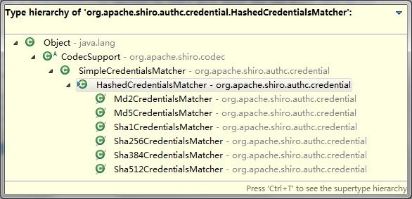

在上一章《Shiro步步为营--开启身份验证》中，我们并未编写任何关于密码校验的代码，却实现了用户登录身份验证。很显然，密码的比对工作是由Shiro来帮我们实现了，接下来,我们就先来看看Shiro是如何完成密码比对的。

# 密码比对过程分析

在调用 `subject.login(token)` 方法后，其内部会通过 `LoginRealm` 调用父类 `AuthenticatingRealm` 的 `assertCredentialsMatch()` 方法来进行密码比对。代码如下：

	protected void assertCredentialsMatch(AuthenticationToken token, AuthenticationInfo info)
			throws AuthenticationException {
		// 获取 Realm 实例中的 CredentialsMatcher 属性
		CredentialsMatcher cm = getCredentialsMatcher();
		if (cm != null) {
			// 调用 CredentialsMatcher 实例的 doCredentialsMatch() 方法对 Token 和 Info
			// 中的密码进行比对
			if (!cm.doCredentialsMatch(token, info)) {
				// not successful - throw an exception to indicate this:
				String msg = "Submitted credentials for token [" + token + "] did not match the expected credentials.";
				throw new IncorrectCredentialsException(msg);
			}
		} else {
			throw new AuthenticationException("A CredentialsMatcher must be configured in order to verify "
					+ "credentials during authentication.  If you do not wish for credentials to be examined, you "
					+ "can configure an " + AllowAllCredentialsMatcher.class.getName() + " instance.");
		}
	}

最终是调用的 CredentialsMatcher 实例的 doCredentialsMatch() 方法对 Token 和 Info 中的密码进行比对。在本例中， LoginRealm 的 redentialsMatcher 属性并未设置，默认使用 SimpleCredentialsMatcher。比对代码如下：

	public boolean doCredentialsMatch(AuthenticationToken token, AuthenticationInfo info) {
		// 取 AuthenticationToken 中的密码
		Object tokenCredentials = getCredentials(token);
		// 取 AuthenticationInfo 中的密码
		Object accountCredentials = getCredentials(info);
		// 判断二者是否相同
		return equals(tokenCredentials, accountCredentials);
	}

# 设置加密算法
在实际项目中，将密码明文保存到数据库中存在极大的安全隐患，推荐的做法是：将密码使用不可逆算法加密，并将加密后的密文保存到数据库中。身份验证时，将用户输入的密码使用相同的算法加密，再将获得的密文与数据库中保存的密文做比较，判断密码是否正确。

AuthenticatingRealm 默认的 SimpleCredentialsMatcher 不使用任何的加密算法，获取到 AuthenticationToken 和 AuthenticationInfo 中的密码后直接进行比对。

为 Realm 设置加密算法非常简单，使用 HashedCredentialsMatcher 替换掉默认的 SimpleCredentialsMatcher 即可。

	/**
	 * Realm配置，需实现 Realm 接口
	 */
	@Bean
	LoginRealm loginRealm() {
		LoginRealm loginRealm = new LoginRealm();
		// 设置加密算法
		HashedCredentialsMatcher credentialsMatcher = new HashedCredentialsMatcher("SHA-1");
		// 设置加密次数
		credentialsMatcher.setHashIterations(16);
		loginRealm.setCredentialsMatcher(credentialsMatcher);
		return loginRealm;
	}

HashedCredentialsMatcher 支持的加密算法有如下几个：

HashedCredentialsMatcher 的 doCredentialsMatch() 方法代码如下：

	@Override
	public boolean doCredentialsMatch(AuthenticationToken token, AuthenticationInfo info) {
		// 取  AuthenticationToken 中的密码经算法加密后的结果
		Object tokenHashedCredentials = hashProvidedCredentials(token, info);
		// 取 AuthenticationInfo 中的密码
		Object accountCredentials = getCredentials(info);
		// 判断二者是否相同
		return equals(tokenHashedCredentials, accountCredentials);
	}

# 设置盐值加密
盐值加密可以实现：即使是密码相同的不同用户，保存到数据库中的密文也应不同。关于 “盐值” 有如下两个要求：盐值必须唯一、盐值不可改变。

在 LoginRealm 中为 SimpleAuthenticationInfo 加入盐值。

		// 使用用户名作为盐值
		ByteSource credentialsSalt = ByteSource.Util.bytes(username);
 
		/**
		 * 将获取到的用户数据封装成 AuthenticationInfo 对象返回，此处封装为 SimpleAuthenticationInfo 对象。 
		 * 参数1. 认证的实体信息，可以是从数据库中获取到的用户实体类对象或者用户名 
		 * 参数2. 查询获取到的登录密码
		 * 参数3. 盐值
		 * 参数4. 当前 Realm 对象的名称，直接调用父类的 getName() 方法即可
		 */
		SimpleAuthenticationInfo info = new SimpleAuthenticationInfo(user, user.getPassword(), credentialsSalt,
				getName());
		return info;
 

	   /**
	     * 可以使用如下方法获取某一字符串加密后的密文
	     * algorithmName 算法类型 例：SHA-1
	     * source 要加密的字符串
	     * salt 盐值
	     * hashIterations 加密次数
	     */
	   new SimpleHash(String algorithmName, Object source, Object salt, int hashIterations)

# 设置多Realm
对于一些比较大型的项目，存储用户的数据源可能会有多个，这在 Shiro 中就意味着需要创建多个 Realm ，各 Realm 所使用的加密算法可以不同。例如，下面这两个 Realm 。

	/**
	 * Realm1 配置，需实现 Realm 接口
	 */
	@Bean
	LoginRealm loginRealm() {
		LoginRealm loginRealm = new LoginRealm();
		// 设置加密算法
		HashedCredentialsMatcher credentialsMatcher = new HashedCredentialsMatcher("SHA-1");
		// 设置加密次数
		credentialsMatcher.setHashIterations(16);
		loginRealm.setCredentialsMatcher(credentialsMatcher);
		return loginRealm;
	}
 
	/**
	 * Realm2 配置，需实现 Realm 接口
	 */
	@Bean
	UserRealm userRealm() {
		UserRealm userRealm = new UserRealm();
		// 设置加密算法
		HashedCredentialsMatcher credentialsMatcher = new HashedCredentialsMatcher("MD5");
		// 设置加密次数
		credentialsMatcher.setHashIterations(16);
		userRealm.setCredentialsMatcher(credentialsMatcher);
		return userRealm;
	}

在 Shiro 配置多Realm 可以通过如下两种方式：

- 方式一 在 ModularRealmAuthenticator 中配置多个Realm
- 方式一 在 SecurityManager 中配置多个Realm

## 方式一

	/**
	 * 配置 SecurityManager
	 */
	@Bean
	public SecurityManager securityManager() {
		DefaultWebSecurityManager securityManager = new DefaultWebSecurityManager();
		// 将 Authenticator 设置给 SecurityManager
		securityManager.setAuthenticator(authenticator());
		return securityManager;
	}
	/**
	 * 配置 ModularRealmAuthenticator
	 */
	@Bean
	public ModularRealmAuthenticator authenticator() {
		ModularRealmAuthenticator authenticator = new ModularRealmAuthenticator();
		List<Realm> realms = new ArrayList<Realm>(16);
		realms.add(loginRealm());
		realms.add(userRealm());
		// 设置多 Realm
		authenticator.setRealms(realms);
		// 设置多 Realm 的认证策略，默认 AtLeastOneSuccessfulStrategy
		AuthenticationStrategy strategy = new FirstSuccessfulStrategy();
		authenticator.setAuthenticationStrategy(strategy);
		return authenticator;
	}
 
## 方式二

	/**
	 * 配置 SecurityManager
	 */
	@Bean
	public SecurityManager securityManager() {
		DefaultWebSecurityManager securityManager = new DefaultWebSecurityManager();
		// 先将 Authenticator 设置给 SecurityManager
		securityManager.setAuthenticator(authenticator());
		// 再将多个 Realm 设置给 SecurityManager
		List<Realm> realms = new ArrayList<Realm>(16);
		realms.add(loginRealm());
		realms.add(userRealm());
		securityManager.setRealms(realms);
		return securityManager;
	}
	/**
	 * 配置 ModularRealmAuthenticator
	 */
	@Bean
	public ModularRealmAuthenticator authenticator() {
		ModularRealmAuthenticator authenticator = new ModularRealmAuthenticator();
		// 设置多 Realm的认证策略，默认 AtLeastOneSuccessfulStrategy
		AuthenticationStrategy strategy = new AllSuccessfulStrategy();
		authenticator.setAuthenticationStrategy(strategy);
		return authenticator;
	}

此时，需要注意必须先设置 Authenticator 再设置  Realms ，否则登录认证时会出现如下错误：

java.lang.IllegalStateException: Configuration error:  No realms have been configured!  One or more realms must be present to execute an authentication attempt.

# 认证策略
ModularRealmAuthenticator 可选的认证策略有下面几个：

