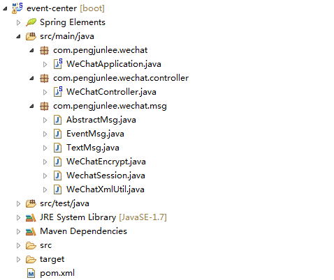

在成功接入微信公众平台之后（如何接入请参考《微信公众号开发：账号申请与接入》），就可以对微信服务器POST过来的消息或者事件XML数据包进行监听与处理了。
在《微信公众号开发：账号申请与接入》的 WeChatController 控制器中， handleMsgAndEvent() 方法用来监听并处理消息与事件，示例项目的完整目录层次如下图所示。

本示例使用了Maven来构建工程，除了要引入基本的SpringMVC-WEB依赖，还需引入以下三个工具包。

		<dependency>
			<groupId>dom4j</groupId>
			<artifactId>dom4j</artifactId>
		</dependency>
		<dependency>
			<groupId>xstream</groupId>
			<artifactId>xstream</artifactId>
			<version>1.2.2</version>
		</dependency>
		<dependency>
			<groupId>org.projectlombok</groupId>
			<artifactId>lombok</artifactId>
		</dependency>

`WeChatController`控制器和`WeChatEncrypt`加密工具类的完整代码在《微信公众号开发：账号申请与接入》中已经贴出，此章中不再重复贴出。

`WechatSession`是处理所有消息的入口。

	import java.io.IOException;
	import java.io.InputStream;
	import java.io.PrintWriter;
	 
	import javax.xml.parsers.DocumentBuilder;
	import javax.xml.parsers.DocumentBuilderFactory;
	import javax.xml.parsers.ParserConfigurationException;
	import javax.xml.transform.TransformerFactory;
	 
	import org.w3c.dom.Document;
	import org.xml.sax.SAXException;
	 
	/**
	 * 处理消息和事件的入口类
	 */
	public class WechatSession
	 
	{
	 
	    private InputStream in;
	 
	    private PrintWriter out;
	 
	    public static TransformerFactory tffactory = TransformerFactory.newInstance();
	 
	    private static DocumentBuilder documentBuilder = null;
	 
	    public static DocumentBuilder getDocumentBuilder()
	    {
	        // 先检查实例是否已创建，如果未创建才进入同步块
	        if (null == documentBuilder)
	        {
	            synchronized (WechatSession.class)
	            {
	                // 再次检查实例是否已创建，如果真的未创建才创建实例
	                if (null == documentBuilder)
	                {
	                    DocumentBuilderFactory factory = DocumentBuilderFactory.newInstance();
	                    try
	                    {
	                        documentBuilder = factory.newDocumentBuilder();
	                    }
	                    catch (ParserConfigurationException e)
	                    {
	                        e.printStackTrace();
	                    }
	                }
	            }
	        }
	        return documentBuilder;
	    }
	 
	    /**
	     * 构造方法
	     * 
	     * @param in
	     * @param out
	     */
	    public WechatSession(InputStream in, PrintWriter out)
	    {
	        this.in = in;
	        this.out = out;
	    }
	 
	    /**
	     * 对接收到的消息和事件进行处理
	     */
	    public void process()
	 
	    {
	        try
	        {
	            Document document = getDocumentBuilder().parse(in);
	            String msgType = document.getElementsByTagName("MsgType").item(0).getTextContent();
	 
	            if ("text".equals(msgType))
	            {
	                TextMsg msg = new TextMsg();
	                msg.read(document);
	                msg.onTextMsg(out);
	            }
	            else if ("event".equals(msgType))
	            {
	                EventMsg msg = new EventMsg();
	                msg.read(document);
	                msg.onEventMsg(out);
	            }
	        }
	        catch (SAXException e)
	        {
	            e.printStackTrace();
	        }
	        catch (IOException e)
	        {
	            e.printStackTrace();
	        }
	    }
	 
	    public void close()
	 
	    {
	        try
	        {
	            if (in != null)
	            {
	                in.close();
	            }
	            if (out != null)
	            {
	                out.flush();
	                out.close();
	            }
	        }
	        catch (IOException e)
	        {
	            e.printStackTrace();
	        }
	    }
	 
	}

`AbstractMsg`是普通消息与事件消息公用的抽象父类，包含了一些通用的基础属性、提供了一些通用的基础方法。

	import java.io.IOException;
	import java.io.StringWriter;
	 
	import javax.xml.transform.OutputKeys;
	import javax.xml.transform.Transformer;
	import javax.xml.transform.dom.DOMSource;
	import javax.xml.transform.stream.StreamResult;
	 
	import org.w3c.dom.CDATASection;
	import org.w3c.dom.Document;
	import org.w3c.dom.Element;
	 
	import lombok.Data;
	 
	/**
	 * 消息与事件的抽象父类
	 */
	@Data
	public abstract class AbstractMsg
	{
	    protected String toUserName;
	    protected String fromUserName;
	    protected String createTime;
	    protected String msgType;
	 
	    /**
	     * 读取Document内容到Java对象
	     * 
	     * @param document
	     */
	    public void read(Document document)
	    {
	        readHead(document);
	        readBody(document);
	    }
	 
	    /**
	     * 获取Java对象的XML字符串
	     */
	    public String write()
	    {
	        Document document = WechatSession.getDocumentBuilder().newDocument();
	        Element root = document.createElement("xml");
	        writeHead(root, document);
	        writeBody(root, document);
	        document.appendChild(root);
	        return readDocument(document);
	    }
	 
	    /**
	     * 读取消息和事件公有的一些基础属性
	     * 
	     * @param document
	     */
	    private void readHead(Document document)
	    {
	        toUserName = document.getElementsByTagName("ToUserName").item(0).getTextContent();
	        fromUserName = document.getElementsByTagName("FromUserName").item(0).getTextContent();
	        createTime = document.getElementsByTagName("CreateTime").item(0).getTextContent();
	        msgType = document.getElementsByTagName("MsgType").item(0).getTextContent();
	 
	    }
	 
	    /**
	     * 消息和事件具体子类需实现该方法，用来读取一些自身独有的属性数据
	     * 
	     * @param document
	     */
	    protected abstract void readBody(Document document);
	 
	    /**
	     * 将Java对象中的基础属性写入Document
	     * 
	     * @param root
	     * @param document
	     */
	    private void writeHead(Element root, Document document)
	    {
	        Element toUserNameElement = document.createElement("ToUserName");
	        CDATASection toUserNameCData = document.createCDATASection(this.toUserName);
	        toUserNameElement.appendChild(toUserNameCData);
	        Element fromUserNameElement = document.createElement("FromUserName");
	        CDATASection fromUserNameCData = document.createCDATASection(this.fromUserName);
	        fromUserNameElement.appendChild(fromUserNameCData);
	        Element createTimeElement = document.createElement("CreateTime");
	        createTimeElement.setTextContent(this.createTime);
	        Element msgTypeElement = document.createElement("MsgType");
	        CDATASection msgTypeCData = document.createCDATASection(this.msgType);
	        msgTypeElement.appendChild(msgTypeCData);
	 
	        root.appendChild(toUserNameElement);
	        root.appendChild(fromUserNameElement);
	        root.appendChild(createTimeElement);
	        root.appendChild(msgTypeElement);
	    }
	 
	    /**
	     * 消息和事件各子类需实现该方法，用来写入一些自身独有的属性数据
	     * 
	     * @param root
	     * @param document
	     */
	    protected abstract void writeBody(Element root, Document document);
	 
	    /**
	     * 获取Document对象中指定元素的内容
	     * 
	     * @param document
	     * @param elementName
	     * @return
	     */
	    protected String getElementContent(Document document, String elementName)
	    {
	        if (document.getElementsByTagName(elementName).getLength() > 0)
	        {
	            return document.getElementsByTagName(elementName).item(0).getTextContent();
	        }
	        return null;
	    }
	 
	    /**
	     * 读取Document对象为XML字符串
	     * 
	     * @param document
	     */
	    private String readDocument(Document document)
	    {
	        String docXml = "";
	        StringWriter writer = new StringWriter();
	        try
	        {
	            Transformer transformer = WechatSession.tffactory.newTransformer();
	            transformer.setOutputProperty(OutputKeys.ENCODING, "UTF-8");// 设置编码字符集
	            transformer.setOutputProperty(OutputKeys.INDENT, "yes");// 设置缩进
	 
	            transformer.transform(new DOMSource(document), new StreamResult(writer));
	            docXml = writer.getBuffer().toString();
	            System.out.println(docXml);// 将获取到的XML字符串打印至控制台
	            writer.close();
	        }
	        catch (Exception e)
	        {
	            e.printStackTrace();
	        }
	        finally
	        {
	            if (null != writer)
	            {
	                try
	                {
	                    writer.close();
	                }
	                catch (IOException e)
	                {
	                    e.printStackTrace();
	                }
	            }
	        }
	        return docXml;
	 
	    }
	 
	}

`TextMsg`普通消息Java类。

	import java.io.PrintWriter;
	 
	import org.w3c.dom.CDATASection;
	import org.w3c.dom.Document;
	import org.w3c.dom.Element;
	 
	import lombok.Data;
	import lombok.EqualsAndHashCode;
	 
	/**
	 * 普通文本消息
	 */
	@Data
	@EqualsAndHashCode(callSuper = false)
	public class TextMsg extends AbstractMsg
	{
	    private String content;
	    private String msgId;
	 
	    /**
	     * 从Document中读取普通文本消息独有的属性数据
	     */
	    @Override
	    protected void readBody(Document document)
	    {
	        content = document.getElementsByTagName("Content").item(0).getTextContent();
	        msgId = document.getElementsByTagName("MsgId").item(0).getTextContent();
	    }
	 
	    /**
	     * 回复时专用，将普通文本消息独有的回复内容写入Document中
	     */
	    @Override
	    protected void writeBody(Element root, Document document)
	    {
	        Element contentElement = document.createElement("Content");
	        CDATASection contentCData = document.createCDATASection(this.content);
	        contentElement.appendChild(contentCData);
	        root.appendChild(contentElement);
	    }
	 
	    public void onTextMsg(PrintWriter out)
	    {
	        System.out.println("此处添加处理普通文本消息的业务逻辑，此处简单回复：你好 某某某");
	        TextMsg msg = new TextMsg();
	        msg.setFromUserName(this.toUserName);
	        msg.setToUserName(this.fromUserName);
	        msg.setCreateTime(this.createTime);
	        msg.setMsgType("text");
	        msg.setContent("你好 " + this.fromUserName);
	        out.print(msg.write());
	    }
	 
	}

`EventMsg`事件消息Java类。

	import java.io.PrintWriter;
	 
	import lombok.Data;
	import lombok.EqualsAndHashCode;
	 
	import org.w3c.dom.Document;
	import org.w3c.dom.Element;
	 
	/**
	 * 事件统一处理类
	 */
	@Data
	@EqualsAndHashCode(callSuper = false)
	public class EventMsg extends AbstractMsg {
		// 事件列表：CLICK(点击自定义菜单)/subscribe(关注)/unsubscribe(取消关注)/SCAN(扫描二维码)/LOCATION(上报地理位置)
		private String event;
	 
		private String eventKey;
		private String ticket;
	 
		private String latitude;
		private String longitude;
		private String precision;
	 
		/**
		 * 从Document中读取各事件独有的属性数据
		 */
		@Override
		protected void readBody(Document document) {
			event = getElementContent(document, "Event").toLowerCase();
			switch (event) {
			case "click": {
				eventKey = getElementContent(document, "EventKey");
				break;
			}
			case "subscribe":
			case "unsubscribe":
			case "scan": {
				eventKey = getElementContent(document, "EventKey");
				ticket = getElementContent(document, "Ticket");
				break;
			}
			case "location": {
				latitude = getElementContent(document, "Latitude");
				longitude = getElementContent(document, "Longitude");
				precision = getElementContent(document, "Precision");
				break;
			}
			default: {
				break;
			}
			}
		}
	 
		/**
		 * 回复时专用，由于事件无须回复，在此空实现
		 */
		@Override
		protected void writeBody(Element root, Document document) {
		}
	 
		public void onEventMsg(PrintWriter out) {
			System.out
					.println("此处添加处理事件的业务逻辑，对于关注事件回复：尊敬的 某某某 女士/先生，欢迎您关注我的个人公众号！");
			switch (event) {
				case "subscribe": {
					TextMsg msg = new TextMsg();
					msg.setFromUserName(this.toUserName);
					msg.setToUserName(this.fromUserName);
					msg.setCreateTime(this.createTime);
					msg.setMsgType("text");
					msg.setContent("尊敬的 " + this.fromUserName + " 女士/先生，欢迎您关注我的个人公众号！");
					out.print(msg.write());
					break;
				}
			}
		}
	}

本文项目源码已上传至CSDN，资源地址：http://download.csdn.net/download/pengjunlee/10257857