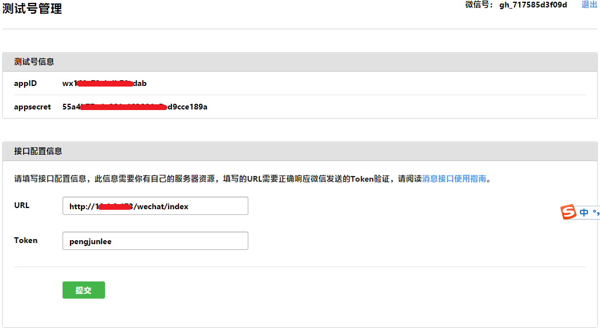

接入微信公众平台开发需要使用微信公众号，由于正式微信公众号注册具有一定门槛，普通用户很难申请。所以，为了帮助开发者快速了解和上手微信公众号开发，熟悉各个接口的调用，微信还提供了微信公众帐号测试号，通过手机微信扫描二维码即可获得测试号。

测试号申请地址：<https://mp.weixin.qq.com/debug/cgi-bin/sandbox?t=sandbox/login>

当普通微信用户向公众号发送消息或者与微信公众号进行互动触发某些事件时，微信服务器将会把这些消息或者事件以`XML`数据包格式POST到开发者配置的服务器地址URL上，对于公众号和公众账号测试号的配置方式如下。

# 配置微信公众号
微信公众平台地址：<https://mp.weixin.qq.com>

配置步骤：`公众平台首页`-->`开发`-->`基本配置`-->`服务器配置`-->`修改配置`。

# 配置测试号
测试号管理地址：<https://mp.weixin.qq.com/debug/cgi-bin/sandboxinfo?action=showinfo&t=sandbox/index>

对于公众账号测试号，在接口配置信息中对`服务器地址URL`和`令牌Token`进行设置，配置规则与正式微信公众号相同。

# 验证服务器地址URL
开发者提交配置信息后，微信服务器将发送GET请求到填写的服务器地址URL上以验证配置的服务器地址URL是否正确并确认开发者的身份，GET请求携带参数如下表所示：

开发者需在配置的服务器地址URL中对GET请求传入的signature进行校验，以确认此次请求是否来自微信服务器，若确认此次GET请求来自微信服务器，只需原样返回echostr参数内容即可接入成功，否则接入失败。

加密/校验流程如下：

1. 将token、timestamp、nonce三个参数进行字典序排序；
2. 将三个参数字符串拼接成一个字符串进行sha1加密；
3. 开发者获得加密后的字符串可与signature对比，判断该请求是否来源于微信。

校验signature的Java示例代码如下。

	import java.io.InputStream;
	import java.io.PrintWriter;
	import java.util.ArrayList;
	import java.util.Arrays;
	import java.util.Collections;
	import java.util.List;
	 
	import javax.servlet.http.HttpServletRequest;
	import javax.servlet.http.HttpServletResponse;
	 
	import org.springframework.stereotype.Controller;
	import org.springframework.web.bind.annotation.GetMapping;
	import org.springframework.web.bind.annotation.PostMapping;
	import org.springframework.web.bind.annotation.RequestMapping;
	import org.springframework.web.bind.annotation.RequestMethod;
	import org.springframework.web.bind.annotation.RequestParam;
	 
	import com.pengjunlee.wechat.msg.WeChatEncrypt;
	import com.pengjunlee.wechat.msg.WechatSession;
	 
	/**
	 * 处理微信消息和事件专用控制器
	 */
	@Controller
	@RequestMapping("/wechat")
	public class WeChatController
	{
	 
	    private static final String token = "pengjunlee";// 公众号管理后台配置的令牌(Token)
	 
	    /**
	     * 验证微信服务器端GET请求 实现一
	     * 
	     * @param out
	     * @param request
	     * @param response
	     */
	    @RequestMapping(value = "/index", method = RequestMethod.GET)
	    public void checkSignature(PrintWriter out, HttpServletRequest request, HttpServletResponse response)
	    {
	 
	        String signature = request.getParameter("signature"); // 微信加密签名
	        String timestamp = request.getParameter("timestamp"); // 时间戳
	        String nonce = request.getParameter("nonce"); // 随机数
	        String echostr = request.getParameter("echostr"); // 随机字符串
	 
	        String[] arr = new String[]
	        {
	                token, timestamp, nonce
	        };
	 
	        // 对数组内的token、timestamp、nonce三个元素进行字典序排序
	        Arrays.sort(arr);
	 
	        // 将排序后的token、timestamp、nonce三个字符串按顺序拼接成一个字符串
	        StringBuilder sb = new StringBuilder();
	        for (int i = 0; i < arr.length; i++)
	        {
	            sb.append(arr[i]);
	        }
	 
	        // 对拼接好的字符串进行SHA-1加密
	        String tmpStr = WeChatEncrypt.encrypt(sb.toString(), WeChatEncrypt.SHA_1);
	 
	        // 将加密后的字符串与signature进行比较
	        if (tmpStr.equals(signature))
	        {
	            out.print(echostr);// 身份验证成功，将echostr字符串内容原样返回
	        }
	        else
	        {
	            out.print("");// 身份验证失败，返回空字符串
	        }
	        out.flush();
	        out.close();
	    }
	 
	    /**
	     * 验证微信服务器端GET请求 实现二
	     * 
	     * @param out
	     * @param signature
	     * @param timestamp
	     * @param nonce
	     * @param echostr
	     * @throws Exception
	     */
	    @GetMapping(value = "/index2")
	    public void checkSignature2(PrintWriter out, @RequestParam(value = "signature", required = true) String signature, @RequestParam String timestamp,
	            @RequestParam String nonce, @RequestParam String echostr) throws Exception
	    {
	        List<String> list = new ArrayList<String>(3)
	        {
	            private static final long serialVersionUID = 1L;
	 
	            @Override
	            public String toString()
	            {
	                return this.get(0) + this.get(1) + this.get(2);
	            }
	        };
	        list.add(token); // 令牌
	        list.add(timestamp);// 时间戳
	        list.add(nonce);// 随机数
	 
	        Collections.sort(list); // 排序
	        String tmpStr = WeChatEncrypt.encrypt(list.toString(), WeChatEncrypt.SHA_1); // SHA-1加密
	        if (signature.equals(tmpStr))
	        {
	            out.write(echostr); // 身份验证成功，将echostr字符串内容原样返回
	        }
	        else
	        {
	            out.write(""); // 身份验证失败，返回空字符串
	        }
	        out.flush();
	        out.close();
	    }
	 
	    /**
	     * 接收微信服务器POST过来的各种消息&事件
	     * 
	     * @param request
	     * @param response
	     * @throws Exception
	     */
	    @PostMapping(value = "/index")
	    public void interceptMsgAndEvent(HttpServletRequest request, HttpServletResponse response) throws Exception
	    {
	        // response.setCharacterEncoding("UTF-8");
	        response.setContentType("application/xml; charset=UTF-8"); // 设置响应内容的类型和编码字符集
	        InputStream in = request.getInputStream();
	        PrintWriter out = response.getWriter();
	        handleMsgAndEvent(in, out);
	    }
	 
	    /**
	     * 处理微信服务器POST过来的各种消息&事件
	     * 
	     * @param in
	     * @param out
	     * @throws Exception
	     */
	    public void handleMsgAndEvent(InputStream in, PrintWriter out) throws Exception
	    {
	 
	        WechatSession session = new WechatSession(in, out);
	        session.process(); // 处理微信消息或者事件
	        session.close(); // 关闭Session
	    }
	}

WeChatEncrypt加密工具类。

	import java.security.MessageDigest;
	import java.security.NoSuchAlgorithmException;
	 
	/**
	 * 微信公众号字符串加密工具类
	 */
	public class WeChatEncrypt
	{
	 
	    public static final String MD5 = "MD5";
	    public static final String SHA_1 = "SHA-1";
	    public static final String SHA_256 = "SHA_256";
	 
	    /**
	     * 使用指定的加密算法对字符串进行加密
	     * 
	     * @param srcStr
	     *            要加密的字符串
	     * @param encryptType
	     *            MD5\SHA_1\SHA_256
	     * @return 加密后的字符串
	     */
	    public static String encrypt(String srcStr, String encryptType)
	    {
	        String desStr = "";
	        try
	        {
	            if ((encryptType == null) || ("".equals(encryptType)))
	                encryptType = "MD5";
	            MessageDigest md = MessageDigest.getInstance(encryptType);
	            md.update(srcStr.getBytes());
	            desStr = bytes2Hex(md.digest());
	        }
	        catch (NoSuchAlgorithmException e)
	        {
	            return srcStr;
	        }
	        return desStr;
	    }
	 
	    /**
	     * 将字节数组转换为16进制字符串
	     * 
	     * @param bts
	     * @return
	     */
	    private static String bytes2Hex(byte[] bts)
	    {
	        String des = "";
	        String tmp = null;
	        for (int i = 0; i < bts.length; i++)
	        {
	            tmp = Integer.toHexString(bts[i] & 0xFF);
	            if (tmp.length() == 1)
	            {
	                des += "0";
	            }
	            des += tmp;
	        }
	        return des;
	    }
	 
	    public static void main(String[] args)
	    {
	        String strSrc = "\u53EF\u4EE5\u52A0\u5BC6\u6C49\u5B57";
	        System.out.println("Source String:" + strSrc);
	        System.out.println("Encrypted String:");
	        System.out.println("Use MD5:" + encrypt(strSrc, null));
	        System.out.println("Use MD5:" + encrypt(strSrc, "MD5"));
	        System.out.println("Use SHA:" + encrypt(strSrc, "SHA-1"));
	        System.out.println("Use SHA-256:" + encrypt(strSrc, "SHA-256"));
	    }
	}

本文项目源码已上传至CSDN，资源地址：<http://download.csdn.net/download/pengjunlee/10257857>
