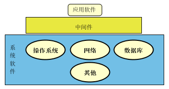
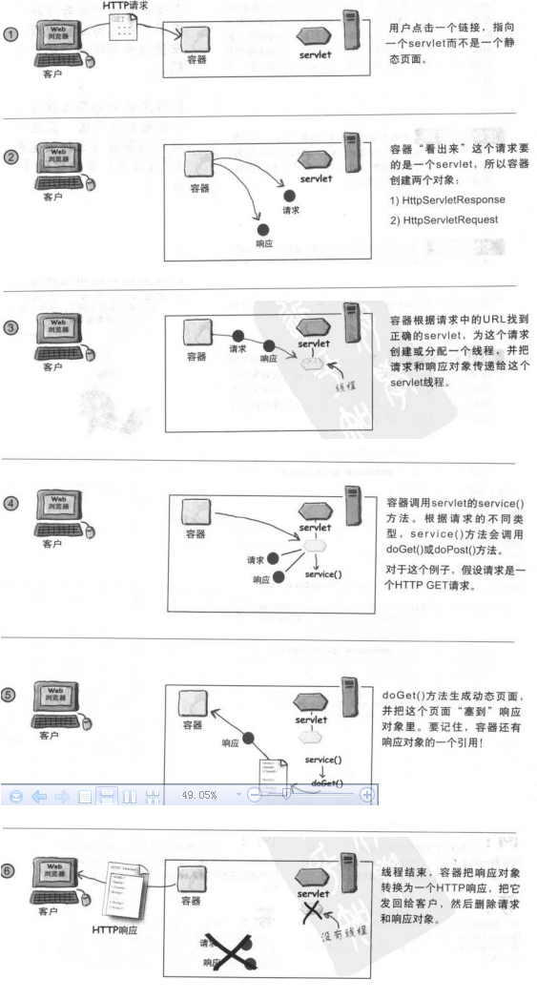

主要参考文章：

- <http://www.cnblogs.com/yezhaohui/archive/2013/05/21/3091931.html>
- <http://www.cnphp6.com/archives/51094>

好记性不如烂笔头，从网上搜罗了一些个人觉得写的比较好，而且比较重要的**Java Web**相关概念，汇总如下。

# Java Web相关概念
## 中间件
所谓中间件指的是提供系统软件和应用软件之间连接的软件，中间件处在操作系统、网络、数据库等系统软件层之上，应用软件层之下，其作用是为处于自己上层的应用软件提供运行与开发的环境，帮助用户灵活、高效地开发和集成复杂的应用软件。这样设计的好处是：将应用程序运行环境与操作系统分离，从而使应用程序开发者不必再考虑诸多的系统通信问题，而直接关注该应用程序的功能实现。我们常说到的容器的概念其实就是中间件的一种。

**J2EE提出的背景：**

- 企业级应用框架的需求：在许多企业级应用中，例如数据库连接、邮件服务、事务处理等都是一些通用企业需求模块，这些模块如果每次在开发中都由开发人员来完成的话，势必将会造成开发周期长和代码可靠性差等问题。于是许多大公司开发了自己的通用模块服务，这些服务性的软件系列统称为中间件。
- 为了通用必须要提出规范，不然无法达到通用，在上面的需求基础之上，许多公司都开发了自己的中间件，但其与用户的沟通都各有不同，从而导致用户无法将各个公司不同的中间件组装在一块为自己服务。从而产生瓶颈。于是提出标准的概念。其实J2EE就是基于JAVA技术的一系列标准。

**目前常见的中间件角色：**

Apache的Tomcat、IBM公司的WebSphere、BEA公司的WebLogic、Kingdee公司的Apusic都属于中间件。并且中间件技术已经不局限于应用服务器、数据库服务器。围绕中间件，在商业中间件及信息化市场主要存在微软阵营、Java阵营、开源阵营。 

## 容器 
容器其实就是一种中间件，常见的有：WEB容器(WEB服务器)、EJB容器、应用服务器。

- WEB容器：给处于其中的应用程序组件（JSP，SERVLET）提供一个环境，JSP容器和SERVLET容器。使JSP,SERVLET直接跟容器中的环境变量接口交互，不必关注其它系统问题。主要由WEB服务器来实现。例如：TOMCAT,WEBLOGIC,WEBSPHERE等。该容器提供的接口严格遵守J2EE规范中的WEB APPLICATION 标准。我们把遵守以上标准的WEB服务器就叫做J2EE中的WEB容器。
- EJB容器：Enterprise java bean 容器。更具有行业领域特色。他提供给运行在其中的组件EJB各种管理功能。只要满足J2EE规范的EJB放入该容器，马上就会被容器进行高效率的管理。并且可以通过现成的接口来获得系统级别的服务。例如邮件服务、事务管理。
- 应用服务器：作为服务器执行共享业务应用程序的底层的系统软件。

WEB容器和EJB容器在原理上是大体相同的，更多的区别是被隔离的外界环境。WEB容器更多的是跟基于HTTP的请求打交道。而EJB容器不是。它是更多的跟数据库、其它服务打交道。但他们都是实现了与外界环境的交互，从而减轻应用程序的负担。例如SERVLET不用关心HTTP的细节，直接引用环境变量session,request,response就行、EJB不用关心数据库连接速度、各种事务控制，直接由容器来完成。

**支持J2EE的应用服务器：**
WEBSPHERE、WEBLOGIC、JBOSS、ORACLE APPLICATION SERVER、SUN ONE APPLICATION SERVER 等。 

# Web容器的作用
## 通信支持

利用容器提供的方法，你可以轻松的让servlet与web服务器进行通信，而不用创建serverSocket去监听某个端口，创建流等，容器知道和web服务器之间的协议，servlet不用去关心web服务器和web代码之间的API，只需要将重点放在业务逻辑上面。

## 生命周期管理

容器控制着servlet的生与死，容器控制servlet的加载，实例化和初始化以及确保servlet能被正常回收，总之不用太多考虑资源管理。

## 多线程管理

容器自动地为每一个servlet请求创建一个java线程，针对客户的请求，如果servlet已经运行完了Http相应的服务方法后，这个线程就可以被kill掉了，但是这并不意味着我们在写servlet的时候不用考虑同步问题了，只是容器帮我们创建和管理多个线程来处理多个请求而已。

## 声明方式实现安全

利用容器，可以使用web.xml部署描述来配置安全性，而不用硬编码在servlet中。

## jsp支持

容器将jsp代码翻译成java代码。

Web容器处理请求工作流程:

