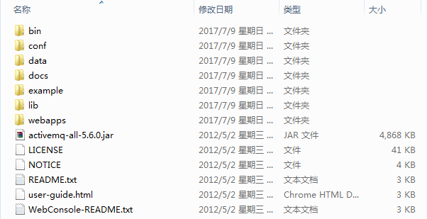
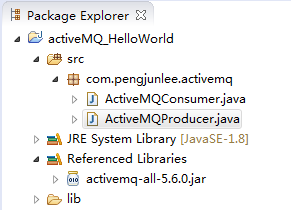
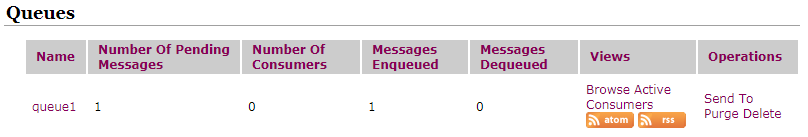
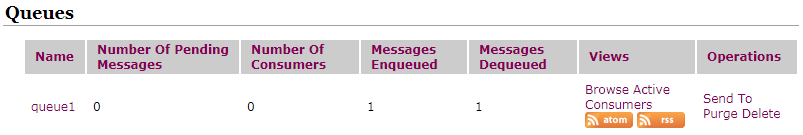

**AcitveMQ**是Apache出品，最流行的，能力强劲的开源消息总线，它是一个完全支持`JMS1.1`和`J2EE 1.4`规范的**JMS Provider**实现。

# AcitveMQ的安装
官网下载地址：<http://activemq.apache.org/download-archives.html>

由于我是在Windows系统下学习AcitveMQ，所以我下载的是：`apache-activemq-5.6.0-bin.zip`，下载好进行解压缩，目录如下：

# AcitveMQ的启动
在解压得到的**bin**目录中包含一个名为`activemq.bat`的脚本，直接运行这个脚本就可以启动一个`broker`，启动之前别忘了需先配置好`%JAVA_HOME%`环境变量。

AcitveMQ程序内部利用jetty容器部署了一个web管理界面，默认服务启动地址：<http://127.0.0.1:8161/admin/>

若要开启管理后台登录密码验证，可按以下步骤进行配置。

修改**jetty**服务器的配置文件，`apache-activemq-5.6.0\conf\jetty.xml`，需将`authenticate`属性设置为`true`。 

    <bean id="securityConstraint" class="org.eclipse.jetty.util.security.Constraint">
        <property name="name" value="BASIC" />
        <property name="roles" value="admin" />
        <property name="authenticate" value="true" />
    </bean>

再修改管理后台的登录用户名密码配置文件，`apache-activemq-5.6.0\conf\jetty-realm.properties`。  

	## ---------------------------------------------------------------------------
	## Licensed to the Apache Software Foundation (ASF) under one or more
	## contributor license agreements.  See the NOTICE file distributed with
	## this work for additional information regarding copyright ownership.
	## The ASF licenses this file to You under the Apache License, Version 2.0
	## (the "License"); you may not use this file except in compliance with
	## the License.  You may obtain a copy of the License at
	## 
	## http://www.apache.org/licenses/LICENSE-2.0
	## 
	## Unless required by applicable law or agreed to in writing, software
	## distributed under the License is distributed on an "AS IS" BASIS,
	## WITHOUT WARRANTIES OR CONDITIONS OF ANY KIND, either express or implied.
	## See the License for the specific language governing permissions and
	## limitations under the License.
	## ---------------------------------------------------------------------------
	 
	# Defines users that can access the web (console, demo, etc.)
	# username: password [,rolename ...]
	admin: admin, admin

> **温馨提示**：windows操作系统下，若开启Internet connection share(ICS)服务会占用`61616`端口，会导致ActiveMQ无法启动。 

# 工程搭建
搭建ActiveMQ工程很简单，只需要创建一个Java project，并将ActiveMQ安装根目录下的`activemq-all-5.6.0.jar` 包添加到项目的构建路径中，创建好的activeMQ_HelloWorld工程目录层级如下。 

先创建生产者**ActiveMQProducer**，其完整代码如下。

	package com.pengjunlee.activemq;
	 
	import javax.jms.Connection;
	import javax.jms.ConnectionFactory;
	import javax.jms.DeliveryMode;
	import javax.jms.Destination;
	import javax.jms.MessageProducer;
	import javax.jms.Session;
	import javax.jms.TextMessage;
	 
	import org.apache.activemq.ActiveMQConnectionFactory;
	 
	public class ActiveMQProducer {
	 
		public static void main(String[] args) throws Exception {
	 
			// 第一步：创建ConnectionFactory，需要指定用户名、密码、以及要连接的地址
			ConnectionFactory connectionFactory = new ActiveMQConnectionFactory(
					ActiveMQConnectionFactory.DEFAULT_USER,
					ActiveMQConnectionFactory.DEFAULT_PASSWORD,
					"tcp://localhost:61616");
	 
			// 第二步：利用ConnectionFactory创建一个Connection连接，并且调用Connection的start()方法开启连接
			Connection connection = connectionFactory.createConnection();
			connection.start();
	 
			// 第三步：通过Connection对象创建Session会话（上下文环境对象），用于接收消息
			// createSession的两个参数:(是否启用事务，消息确认模式)
			Session session = connection.createSession(Boolean.FALSE,
					Session.AUTO_ACKNOWLEDGE);
	 
			// 第四步：通过Session创建Destination对象,目的地指的是生产消息的目标和消费消息的来源
			// 在PTP模式中，Destination被称作Queue队列，在Pub/Sub模式中，Destination被称作Topic主题
			Destination destination = session.createQueue("queue1");
	 
			// 第五步：通过Session对象创建消息生产者和消息消费者（MessageProducer/MessageConsumer）
			MessageProducer messageProducer = session.createProducer(destination);
	 
			// 第六步：利用messageProducer的setDeliveryMode()方法设置消息是否需要持久化
			messageProducer.setDeliveryMode(DeliveryMode.NON_PERSISTENT);
	 
			// 第七步：通过Session创建Message消息
			TextMessage textMessage = session
					.createTextMessage("this is a activeMQ Message!");
	 
			// 第八步：调用MessageProducer的send()方法发送消息
			messageProducer.send(textMessage);
	 
			// 第九步：关闭连接，释放资源
			if (connection != null) {
				connection.close();
			}
		}
	 
	}

运行ActiveMQProducer，登录<http://127.0.0.1:8161/admin/>管理后台，其队列信息如下。  

再创建消息消费者**ActiveMQConsumer**，其完整代码如下。

	package com.pengjunlee.activemq;
	 
	import javax.jms.Connection;
	import javax.jms.ConnectionFactory;
	import javax.jms.Destination;
	import javax.jms.JMSException;
	import javax.jms.MessageConsumer;
	import javax.jms.Session;
	import javax.jms.TextMessage;
	 
	import org.apache.activemq.ActiveMQConnectionFactory;
	 
	public class ActiveMQConsumer {
	 
		public static void main(String[] args) throws JMSException {
			// 第一步：创建ConnectionFactory，需要指定用户名、密码、以及要连接的地址
			ConnectionFactory connectionFactory = new ActiveMQConnectionFactory(
					ActiveMQConnectionFactory.DEFAULT_USER,
					ActiveMQConnectionFactory.DEFAULT_PASSWORD,
					"tcp://localhost:61616");
	 
			// 第二步：利用ConnectionFactory创建一个Connection连接，并且调用Connection的start()方法开启连接
			Connection connection = connectionFactory.createConnection();
			connection.start();
	 
			// 第三步：通过Connection对象创建Session会话（上下文环境对象），用于接收消息
			// createSession的两个参数:(是否启用事务，消息确认模式)
			Session session = connection.createSession(Boolean.FALSE,
					Session.AUTO_ACKNOWLEDGE);
	 
			// 第四步：通过Session创建Destination对象,目的地指的是生产消息的目标和消费消息的来源
			// 在PTP模式中，Destination被称作Queue队列，在Pub/Sub模式中，Destination被称作Topic主题
			Destination destination = session.createQueue("queue1");
	 
			// 第五步：通过Session对象创建消息生产者和消息消费者（MessageConsumer/MessageConsumer）
			MessageConsumer messageConsumer = session.createConsumer(destination);
	 
			// 第六步：调用MessageConsumer的receive()方法获取消息
			TextMessage textMessage = (TextMessage) messageConsumer.receive();
			System.out.println(textMessage.getText());
	 
			// 第七步：关闭连接，释放资源
			if (connection != null) {
				connection.close();
			}
		}
	}

运行**ActiveMQConsumer**，登录后台再次查看队列信息。  

# ConnectionFactory连接密码认证

	ConnectionFactory connectionFactory = new ActiveMQConnectionFactory(
					ActiveMQConnectionFactory.DEFAULT_USER,
					ActiveMQConnectionFactory.DEFAULT_PASSWORD,
					"tcp://localhost:61616");

在`new ActiveMQConnectionFactory`时若要开启登录密码验证，可按以下步骤进行配置。 

修改`apache-activemq-5.6.0\conf\activemq.xml`，在`<systemUsage>`节点前面添加如下配置。

	<plugins>  
        <simpleAuthenticationPlugin>  
            <users>  
                <authenticationUser username="${activemq.username}" password="${activemq.password}" groups="users,admins"/>  
            </users>  
        </simpleAuthenticationPlugin>  
     </plugins>  

    <!--
    The systemUsage controls the maximum amount of space the broker will
    use before slowing down producers. For more information, see:
    http://activemq.apache.org/producer-flow-control.html
    If using ActiveMQ embedded - the following limits could safely be used:
    <systemUsage>
        <systemUsage>
            <memoryUsage>
                <memoryUsage limit="20 mb"/>
            </memoryUsage>
            <storeUsage>
                <storeUsage limit="1 gb"/>
            </storeUsage>
            <tempUsage>
                <tempUsage limit="100 mb"/>
            </tempUsage>
        </systemUsage>
    </systemUsage>
    -->

在`apache-activemq-5.6.0\conf\credentials.properties`文件中指定用户名和密码。 

	## ---------------------------------------------------------------------------
	## Licensed to the Apache Software Foundation (ASF) under one or more
	## contributor license agreements.  See the NOTICE file distributed with
	## this work for additional information regarding copyright ownership.
	## The ASF licenses this file to You under the Apache License, Version 2.0
	## (the "License"); you may not use this file except in compliance with
	## the License.  You may obtain a copy of the License at
	## 
	## http://www.apache.org/licenses/LICENSE-2.0
	## 
	## Unless required by applicable law or agreed to in writing, software
	## distributed under the License is distributed on an "AS IS" BASIS,
	## WITHOUT WARRANTIES OR CONDITIONS OF ANY KIND, either express or implied.
	## See the License for the specific language governing permissions and
	## limitations under the License.
	## ---------------------------------------------------------------------------
	 
	# Defines credentials that will be used by components (like web console) to access the broker
	 
	activemq.username=activeMQ
	activemq.password=123456
	guest.password=password

在`new ActiveMQConnectionFactory`时需指定用户名和密码。 

	ConnectionFactory connectionFactory = new ActiveMQConnectionFactory(
					"activeMQ",
					"123456",
					"tcp://localhost:61616");

