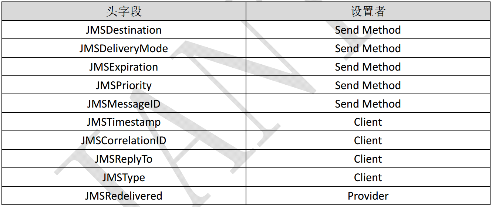

# 为什么需要MOM？
当前，**CORBA**（Common Object Request Broker Architecture,通用对象请求代理体系结构）、**DCOM**（Microsoft Distributed Component Object Model，分布式组件对象模型）、**RMI**（Remote Method Invocation，远程方法调用）等RPC中间件技术已经广泛应用于各个领域。但是面对规模和复杂度都越来越高的分布式系统，这些技术也显示出其局限性：

- 同步通信：客户端发出调用后，必须等待服务端完成处理并返回结果后才能继续执行；
- 客户端和服务端进程对象的生命周期紧密耦合：客户端进程和服务端进程都必须正常运行，如果由于服务端进程崩溃或者网络故障导致客户端的请求不可达，客户端会接收到异常；
- 点对点通信：客户端的一次调用只能发送给某个单独的目标对象。

**MOM**（Message Oriented Middleware，面向消息的中间件）较好的解决了以上问题。

1. 发送者将消息发送给消息服务器，消息服务器将消息存放在若干队列中，在合适的时候再将消息发送给接收者。这种模式下，发送和接收是异步的，发送者无需等待；
2. 二者的生命周期未必相同：发送消息的时候接收者不一定运行，接收消息的时候发送者也不一定运行；
3. 一对多通信：对于一个消息可以有多个接收者。

接下来，还得再介绍一个与MOM紧密相关的概念----**JMS规范**，它的设计目的就是给 java 程序员提供一种通用的方式来创建、发送、接收和查看企业消息系统的消息。 

# 什么是JMS？
**JMS**（Java Message Service，Java消息服务）是一个Java平台中关于面向消息中间件（MOM）的技术规范，用于在两个应用程序之间，或分布式系统中发送消息，进行异步通信。它通过提供标准的产生、发送、接收消息的接口来简化企业应用的开发。JMS只是接口，并没有给予实现，实现JMS接口的消息中间件称为**JMS Provider**，常见有：Apache的`ActiveMQ`、阿里巴巴的`RocketMQ`、IBM的`MQSeries`、Microsoft的`MSMQ`和BEA的`MessageQ`、`RabbitMQ`等，它们基本都遵循JMS规范。  

# JMS的基本构件

## 连接工厂（ConnectionFactory ）
**ConnectionFactory** 封装了一系列连接配置参数，这些参数由管理员定义。客户端使用它来创建和 JMS 提供商的连接，例如ActiveMQ提供的连接工厂叫作ActiveMQConnectionFactory。
ConnectionFactory 对象支持并发使用。  

## 连接（Connection ）
**JMS Connection** 是一个客户端到 JMS 提供商间的活动连接。它通常分配在 Java 虚拟机外部的提供商的资源。

Connection 对象支持并发使用，主要作用如下：

- 它封装了一个与 JMS 提供商的连接。他通常代表一个在提供商服务域和客户端间的打开的 TCP/IP Socket。
- 在客户端授权时创建它。
- 它可以指定一个唯一的客户端标识。
- 它创建 Session 对象。
- 它提供 ConnectionMetaData。
- 它支持可选的 ExceptionListener。
- 由于在创建Connection 时设置授权和通讯，因此Connection 相对是重量级的JMS 对象。

大多数客户端使用一个连接来执行所有的消息动作。其他更先进的应用可以使用多个Connection。
 
## 会话（Seesion ）

- 它是 MessageProducer 和 MessageConsumer 的工厂。
- 它是 TemporaryTopic 和 TemporaryQueue 的工厂。
- 它为需要动态操纵提供商专有目的地名字的客户端提供了一种创建 Queue 或 Topic对象的途径。
- 它提供了提供商优化后的消息工厂。
- 它支持事务串，这些事务将跨会话生产者和消费者的工作组合成原子单元。
- 它为它消费的消息和它生产的消息定义了一个连续的顺序。
- 它保留它消费的消息直到这些消息被确认。
- 它序列化注册到它的 MessageListener 的执行。
- 它是 QueueBrowser 的工厂。

## 目的地（Destination ）
**JMS Destination** 是客户用来指定它生产的消息的目标和它消费的消息的来源的对象。JMS 没有定义标准的地址语法。尽管考虑到了，但在现存的地址语义有很大差别的企业消息产品间寻求一个单一的语法是不可能的。因此， JMS 定义了 Destination 对象来封装提供商特有的地址作为替代方案。Destination 支持并发使用。  

## 消息生产者（MessageProducer）
客户端使用 **MessageProducer** 来向 **Destination** 发送消息。通过向会话的`createProducer`方法传入 **Queue** 或 **Topic** 来创建`MessageProducer`。

客户端也可以不提供目的地来创建消息生产者。在这种情况下，必须在每次发送操作时提供目的地。这种风格的生产者的通常用于使用请求的`JMSReplyTo`目的地来发送请求的回复。

客户端可以指定一个缺省的转发模式、优先级和消息的生存时间。它也可以为每个消息指定转发模式、优先级和消息的生存时间。

客户端每次创建一个`MessageProducer`，它定义了一个新的消息序列，这些消息和以前发送的消息没有顺序关系。 

## 消息消费者（MessageConsumer ）

- 同步消费。通过调用消费者的receive方法从目的地中显式提取消息。receive方法可以一直阻塞到消息到达。
- 异步消费。客户端可以为消费者注册一个消息监听器，以定义在消息到达时所采取的动作。

## 消息（Message）
JMS消息由以下三部分组成的：

- 消息头。所有的消息都支持相同的头字段集。头字段包含了客户端和提供商都要使用的用于标识和路由消息的值。
- 应用专有属性—为消息增加应用专有的头字段提供的机制。 
- 标准属性—JMS 定义的一些标准属性，它们相当于可选的头字段。 
- 提供商专有属性—在集成 JMS 客户端和 JMS 提供商本地客户端时可能会用到提供商专有的属性。 JMS 为这些属性定义了命名规范。 
- 消息体。JMS定义的消息体类型有`TextMessage`、`MapMessage`、`BytesMessage`、`StreamMessage`和`ObjectMessage`。  

发送时设置消息头字段的值如下图：

# JMS的可靠性机制
## 消息确认

- `Session.AUTO_ACKNOWLEDGE`。当客户成功的从receive方法返回的时候，或者从MessageListener.onMessage方法成功返回的时候，会话自动确认客户收到的消息。 
- `Session.CLIENT_ACKNOWLEDGE`。客户通过消息的acknowledge方法确认消息。需要注意的是，在这种模式中，确认是在会话层上进行：确认一个被消费的消息将自动确认所有已被会话消费的消息。例如，如果一个消息消费者消费了10个消息，然后确认第5个消息，那么所有10个消息都被确认。 
- `Session.DUPS_ACKNOWLEDGE`。该选择只是会话迟钝的确认消息的提交。如果JMS Provider失败，那么可能会导致一些重复的消息。如果是重复的消息，那么JMS Provider必须把消息头的JMSRedelivered字段设置为true。 

当客户端指定 JMS 消费者的消息要显式地被确认时， 所有的 JMS 消息使用 acknowledge()方法来确认消息。
如果客户端使用自动确认，那么忽略对确认方法的调用。  

## 持久性

- `PERSISTENT`。指示JMS Provider持久保存消息，以保证消息不会因为JMS Provider的失败而丢失。 
- `NON_PERSISTENT`。不要求JMS Provider持久保存消息。  

## 优先级
可以使用消息优先级来指示JMS Provider首先提交紧急的消息。优先级分10个级别，从0（最低）到9（最高）。如果不指定优先级，默认级别是4。需要注意的是，JMS Provider并不一定保证按照优先级的顺序提交消息。 

## 消息过期
可以设置消息在一定时间后过期，默认是永不过期。 

## 临时目的地
可以通过会话上的`createTemporaryQueue`方法和`createTemporaryTopic`方法来创建临时目的地。它们的存在时间只限于创建它们的连接所保持的时间。只有创建该临时目的地的连接上的消息消费者才能够从临时目的地中提取消息。 

## 持久订阅
首先消息生产者必须使用PERSISTENT提交消息。客户可以通过会话上的`createDurableSubscriber`方法来创建一个持久订阅，该方法的第一个参数必须是一个**topic**，第二个参数是订阅的名称。 JMS Provider会存储发布到持久订阅对应的topic上的消息。如果最初创建持久订阅的客户或者任何其它客户使用相同的连接工厂和连接的客户ID、相同的主题和相同的订阅名再次调用会话上的`createDurableSubscriber`方法，那么该持久订阅就会被激活。JMS Provider会象客户发送客户处于非激活状态时所发布的消息。 持久订阅在某个时刻只能有一个激活的订阅者。持久订阅在创建之后会一直保留，直到应用程序调用会话上的`unsubscribe`方法。 

## 本地事务
在一个JMS客户端，可以使用本地事务来组合消息的发送和接收。**JMS Session**接口提供了`commit`和`rollback`方法。事务提交意味着生产的所有消息被发送，消费的所有消息被确认；事务回滚意味着生产的所有消息被销毁，消费的所有消息被恢复并重新提交，除非它们已经过期。 事务性的会话总是牵涉到事务处理中，commit或rollback方法一旦被调用，一个事务就结束了，而另一个事务被开始。关闭事务性会话将回滚其中的事务。 需要注意的是，如果使用请求/回复机制，即发送一个消息，同时希望在同一个事务中等待接收该消息的回复，那么程序将被挂起，因为知道事务提交，发送操作才会真正执行。 需要注意的还有一个，消息的生产和消费不能包含在同一个事务中。 

## JMS 规范的变迁
JMS的最新版本的是1.1。它和同1.0.2版本之间最大的差别是，JMS1.1通过统一的消息传递域简化了消息传递。这不仅简化了JMS API，也有利于开发人员灵活选择消息传递域，同时也有助于程序的重用和维护。 以下是不同消息传递域的相应接口：

|JMS公共|点对点域|发布/订阅域|
|-|-|-|
|ConnectionFactory|QueueConnectionFactory|TopicConnectionFactory|
|Connection|QueueConnection|TopicConnection|
|Destination|Queue|Topic|
|Session|QueueSession|TopicSession|
|MessageProducer|QueueSender|TopicPublisher|
|MessageConsumer|QueueReceiver|TopicSubscriber|

# JMS消息传递模型
**JMS1.0.2**规范中定义了两种消息传递模型：点对点（PTP）消息传递模型和发布/订阅消息传递模型。 

点对点消息传递模型的特点如下：

- 每个消息只能有一个消费者。 
- 消息的生产者和消费者之间没有时间上的相关性。无论消费者在生产者发送消息的时候是否处于运行状态，它都可以提取消息。 
- 在点对点消息传递模型中，目的地被成为队列（queue）。

发布/订阅消息传递模型的特点如下：

- 每个消息可以有多个消费者。
- 生产者和消费者之间有时间上的相关性。订阅一个主题的消费者只能消费自它订阅之后发布的消息。JMS规范允许客户创建持久订阅，这在一定程度上放松了时间上的相关性要求。持久订阅允许消费者消费它在未处于激活状态时发送的消息。 
- 在发布/订阅消息传递模型中，目的地被成为主题（topic）。

