# kafka-manager 简介
为了简化开发者和服务工程师维护Kafka集群的工作，yahoo构建了一个基于Web的Kafka集群管理工具，叫做`Kafka Manager`。这个管理工具可以很容易地发现分布在集群中的哪些topic分布不均匀，或者是分区在整个集群分布不均匀的的情况。它支持管理多个集群、选择副本、副本重新分配以及创建Topic。同时，这个管理工具也是一个非常好的可以快速浏览这个集群的工具，有如下功能：

- 管理多个kafka集群
- 便捷的检查kafka集群状态(topics,brokers,备份分布情况,分区分布情况)
- 选择你要运行的副本
- 基于当前分区状况进行
- 可以选择topic配置并创建topic(0.8.1.1和0.8.2的配置不同)
- 删除topic(只支持0.8.2以上的版本并且要在broker配置中设置delete.topic.enable=true)
- Topic list会指明哪些topic被删除（在0.8.2以上版本适用）
- 为已存在的topic增加分区
- 为已存在的topic更新配置
- 在多个topic上批量重分区
- 在多个topic上批量重分区(可选partition broker位置)

kafka-manager 项目地址：https://github.com/yahoo/kafka-manager

# 安装
## 环境要求

- Kafka 0.8.1.1 or 0.8.2.* or 0.9.0.*
- Java 8+
- zookeeper 2+

本次实验所用的环境是`kafka-0.9.1.0`，`jdk-1.8.0_60`，`zookeeper-3.4.7`，下载解压安装运行：

	# start zookeeper
	cd /usr/local/zookeeper-3.4.7
	./bin/zkServer.sh start
	#
	# start kafka
	cd /usr/local/kafka_2.11-0.9.0.0
	./bin/kafka-server-start.sh ./config/server.properties

## 下载安装 kafka-manager
### 下载编译

	git clone https://github.com/yahoo/kafka-manager
	cd kafka-manager
	# 因为要编译。所以下面这步操作要等很久
	sbt clean distcd target/ 
	# 在target目录下我们可以看到 kafka-manager
	kafka-manager-1.3.0.8.zip

> tips：使用sbt编译打包的时候时间可能会比较长，如果你hang在`Loading project definition from kafka-manager/project`可以修改`project/plugins.sbt`中的`LogLevel`参数将`logLevel := Level.Warn`修改为`logLevel := Level.Debug`。或者，简单点直接下载编译好的安装包，下面给出网友编译好的`kafka-manager-1.3.3.7.zip`，网盘链接：<https://pan.baidu.com/s/1qYifoa4> 密码：`el4o`

### 解压

	unzip kafka-manager-1.3.0.8.zip -d /usr/local
	cd /usr/local/kafka-manager-1.3.0.8

### 修改配置
编辑`conf/application.properties`文件，修改`Zookeeper`集群地址。

	# 如果zk是集群，这里填写多个zk地址
	kafka-manager.zkhosts="localhost:2181"

### 启动

	bin/kafka-manager

kafka-manager 默认的端口是9000，可通过`-Dhttp.port`指定端口; `-Dconfig.file=conf/application.conf`指定配置文件:

	nohup bin/kafka-manager -Dconfig.file=conf/application.conf -Dhttp.port=8080 &

我们用浏览器访问试试，界面非常简洁。

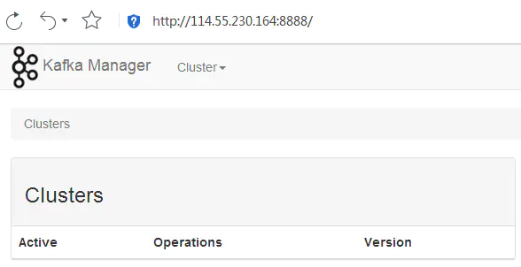

这样便安装成功了。

# 测试 kafka-mamager
## 新建 Cluster
输入要监控的Kafka集群的名称及Zookeeper集群的地址。

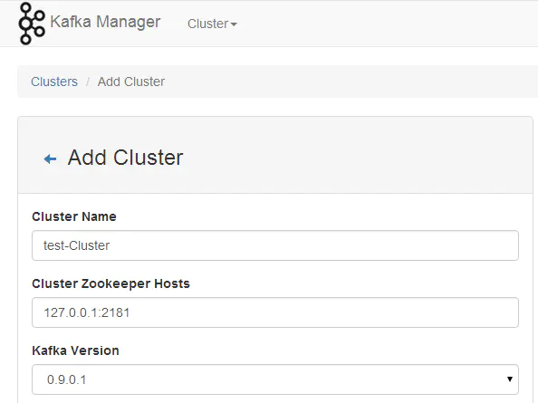

建好之后看到如下界面。

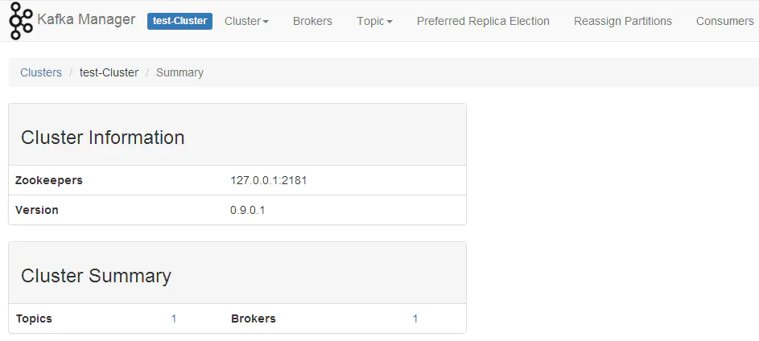

在保存Cluster时，若勾选了启用 JMX 投票，如果 kafka 没有设置 JMX_PORT， kafka manager 日志会出现如下错误信息：

[error] k.m.a.c.BrokerViewCacheActor - Failed to get broker topic segment metrics for BrokerIdentity(1,192.168.118.15,9092,-1,false)
java.lang.IllegalArgumentException: requirement failed: No jmx port but jmx polling enabled!

解决办法：修改 kafka-server-start.sh，增加 JMX 的端口信息。

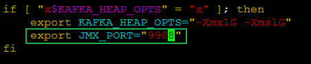

修改kafka-run-class.sh，增加绿色部分，注意对应的 ip地址。

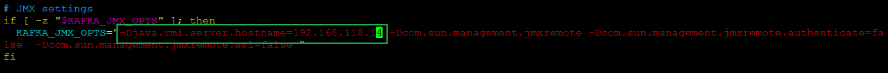

三个节点都需要修改，修改完毕记得重启`kafka`服务。

## 新建topic
填写分区和副本个数。

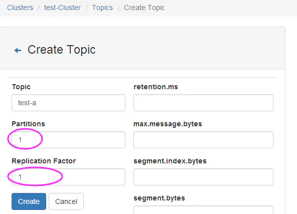

## 查看topic
在 Kafka-manager 中看到的topic如下：

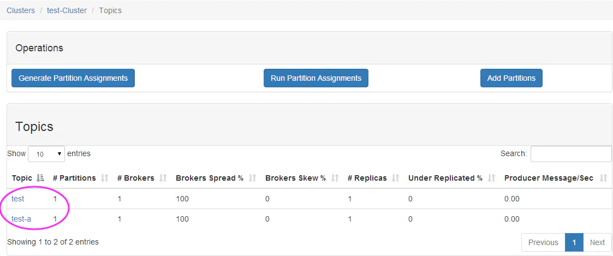

在服务器上通过`kafka-topics.sh`命令查询到的topic如下：

	# bin/kafka-topics.sh --list --zookeeper localhost:2181

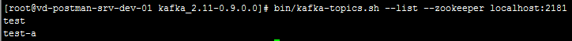

## 启动 consumer

	bin/kafka-console-consumer.sh --zookeeper localhost:2181 --from-beginning --topic test-a

## 启动 producer

	bin/kafka-console-producer.sh --broker-list 10.26.236.43:9092 --topic test-a

此时， 看到的Broker列表如下。

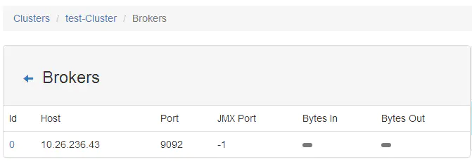

输入 message。

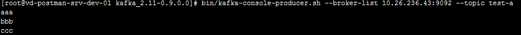

可以看到 consumer 已经收到消息。

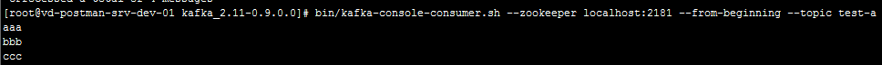

到这里，我们的kafka-manager已搭建测试成功，它的其他用法大家可自行测试。