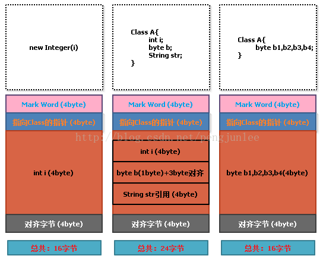
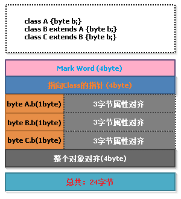

参考书籍：《Java特种兵（上册）》 

# 对象内存结构

Class文件以字节码的形式存储在方法区当中，用来描述一个类本身的内存结构。当使用Class文件新建对象时，对象实例的内存结构又究竟是个什么样子呢？ 

如图所示，为了表示对象的属性、方法等信息，HotSpot VM使用对象头部的一个指针指向Class区域的方式来找到对象的Class描述，以及内部的方法、属性入口。除此之外，还在对象的头部划分了部分空间（Mark Word），用于描述与对象相关的其他信息，例如：是否加锁、GC标志位、Minor GC次数、对象默认的hashCode（System.identityHashCode(object)可获取对象的这个值）。

在32位系统下，存放Class指针的空间大小是4字节，Mark Word空间大小也是4字节，因此就是8字节的头部，如果是数组还需要增加4字节来表示数组的长度。

在64位系统及64位JVM下，开启指针压缩（参数是 -XX:+UseCompressedOops），那么头部存放Class指针的空间大小还是4字节，而Mark Word区域会变大，变成8字节，也就是头部最少为12字节。

若未开启指针压缩，那么保存Class指针的空间大小也会变成8字节，那么对象头部会变成16字节。另外，在64位模式下，若未开启压缩，引用也会变成8字节。

此外，Java对象将以8字节对齐在内存中，也就是对象占用的空间不是8字节的倍数，将会被补齐为8字节的倍数，这样做的好处是，在对象分配和查找的过程中不用考虑过多的偏移量问题。

以下是在32位系统下一些常见对象占用的空间大小示例。 

## 没有继承的对象属性排布
在默认情况下，HotSpot VM会按照一个顺序排布对象的内部属性，这个顺序是，long/double-->int/float-->short/char-->byte/boolean-->Reference（与对象本身的属性顺序无关）。

## 有继承的对象属性排布
在HotSpot VM中，有继承关系的对象在创建时，父类的属性会被分配到相应的对象中，由于父类的属性不能和子类混用，所以它们必须单独排布在一个地方，可以认为它们就是从上到下的一个顺序。以两重继承为例，对象继承属性排布规则如下图所示。 

这里的对齐有两种：一是整个对象的8字节对齐；二是父类到子类的属性对齐。在32位及64位压缩模式下，会按照4字节对齐。

例如下面的例子： 

class A {byte b;}
class B extends A {byte b;}
class C extends B {byte b;}

# 如何计算对象大小

有时，我们需要知道Java对象到底占用多少内存，有人通过连续调用两次System.gc()比较两次gc前后内存的使用量在计算java对象的大小，也有人根据Java虚拟机规范中的Java对象内存排列估算对象的大小，这两种方法或多或少都有问题，因为System.gc()并不一定促发GC，同一个类型的对象在32位与64位JVM中使用的内存会不一样，在64位虚拟机中是否开启指针压缩也会影响Java对象在内存中的大小。

那么有没有一种既准确又方便的方法计算对象的大小呢？答案是肯定的。在Java 5中引入了Instrumentation类，这个类提供了计算对象内存占用量的方法；Hotspot支持instrumentation框架，其他的虚拟机也提供了类似的框架。

使用Instrumentation类计算Java对象大小的过程如下：

## 创建一个含有premain()方法的Java 类。
	package sizeof;
	 
	import java.lang.instrument.Instrumentation;
	import java.lang.reflect.Array;
	import java.lang.reflect.Field;
	import java.lang.reflect.Modifier;
	import java.util.IdentityHashMap;
	import java.util.Map;
	import java.util.Stack;
	 
	public class DeepObjectSizeOf {
		
		private static Instrumentation inst;
	 
		public static void premain(String agentArgs, Instrumentation instP) {
			inst = instP;
		}
	 
		public static long sizeOf(Object object) {
			//计算当前对象的内存大小，不包含引用对象
			return inst.getObjectSize(object);
		}
		
		public static long deepSizeOf(Object obj) {//深入检索对象，并计算大小
		       Map<Object, Object> visited = new IdentityHashMap<Object, Object>();
		       Stack<Object> stack = new Stack<Object>();
		       long result = internalSizeOf(obj, stack, visited);
		       while (!stack.isEmpty()) {//通过栈进行遍历
		          result += internalSizeOf(stack.pop(), stack, visited);
		       }
		       visited.clear();
		       return result;
		    }
	 
		    private static boolean needSkipObject(Object obj, Map<Object, Object> visited) {
		       if (obj instanceof String) {
		          if (obj == ((String) obj).intern()) {
		             return true;
		          }
		       }
		       return (obj == null) || visited.containsKey(obj);
		    }
	 
		    private static long internalSizeOf(Object obj, Stack<Object> stack, Map<Object, Object> visited) {
		       if (needSkipObject(obj, visited)) {
		           return 0;
		       }
		       visited.put(obj, null);//将当前对象放入栈中
		       long result = 0;
		       result += sizeOf(obj);
		       Class <?>clazz = obj.getClass();
		       if (clazz.isArray()) {//如果数组
		           if(clazz.getName().length() != 2) {//如果primitive type array，Class的name为2位
		              int length =  Array.getLength(obj);
		              for (int i = 0; i < length; i++) {
		                 stack.add(Array.get(obj, i));
		              }
		           }
		           return result;
		       }
		       return getNodeSize(clazz , result , obj , stack);
		   }
	 
		   //这个方法获取非数组对象自身的大小，并且可以向父类进行向上搜索
		   private static long getNodeSize(Class <?>clazz , long result , Object obj , Stack<Object> stack) {
		      while (clazz != null) {
		          Field[] fields = clazz.getDeclaredFields();
		          for (Field field : fields) {
		              if (!Modifier.isStatic(field.getModifiers())) {//这里抛开静态属性
		                   if (field.getType().isPrimitive()) {//这里抛开基本关键字（因为基本关键字在调用java默认提供的方法就已经计算过了）
		                       continue;
		                   }else {
		                       field.setAccessible(true);
		                      try {
		                           Object objectToAdd = field.get(obj);
		                           if (objectToAdd != null) {
		                                  stack.add(objectToAdd);//将对象放入栈中，一遍弹出后继续检索
		                           }
		                       } catch (IllegalAccessException ex) {
		                           assert false;
		                  }
		              }
		          }
		      }
		      clazz = clazz.getSuperclass();//找父类class，直到没有父类
		   }
		   return result;
		  }
	}

JVM会在应用程序运行之前调用这个Java 类的premain()方法（也就是在执行应用程序的main方法之前），JVM会在调用该方法时传入一个实现Instrumentation接口的实例，通过调用此接口实例的getObjectSize()方法可以计算出对象的大小（只计算当前对象的大小，不会进一步计算内部引用对象的大小）。 

## 将创建好的Java类打成一个jar包
在打包之前先创建一个MANIFEST.txt文件作为这个jar包的清单文件，其内容如下： 

	Manifest-Version: 1.0
	Premain-Class: sizeof.DeepObjectSizeOf

按照Java类文件的包路径创建好目录（DeepObjectSizeOf.class文件放在sizeof文件夹中）。

使用用如下命令创建jar包：

	jar -cmf MANIFEST.txt java_sizeof.jar sizeof/*

## 修改JVM启动配置
修改Eclipse IDE的JVM启动配置，增加-javaagent启动参数：

	-javaagent:jar文件路径
我创建的 java_sizeof.jar放在D:\sizeof目录下，设置参数如下。

## 测试样例
创建一个测试类SizeOfMain.java，代码如下。

	package sizeof;
	 
	public class SizeOfMain {
		
		public static void main(String[] args) {
			System.out.println("new Integer(1) 对象大小："
					+ DeepObjectSizeOf.deepSizeOf(new Integer(1)));
			System.out.println("new String(\"sizeof\") 对象大小："
					+ DeepObjectSizeOf.deepSizeOf(new String("sizeof")));
		}
	}

在64位机器上（不开启指针压缩）：

设置参数：-javaagent:d:\sizeof/java_sizeof.jar -XX:-UseCompressedOops

执行结果：

在64位机器上（开启指针压缩）：

设置参数：-javaagent:d:\sizeof/java_sizeof.jar -XX:+UseCompressedOops

执行结果：

