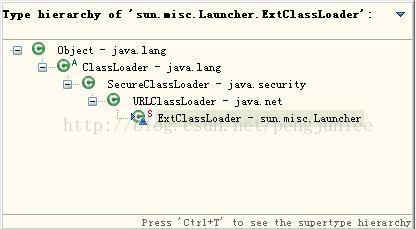
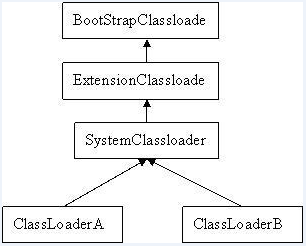
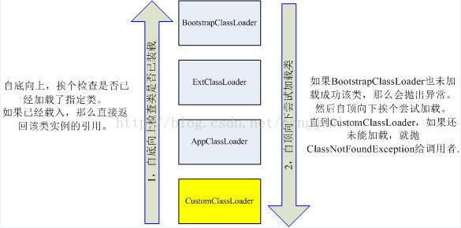

# 一、前言
每个开发人员对Java.lang.ClassNotFoundExcetpion这个异常肯定都不陌生，这背后就涉及到了java技术体系中的类加载。Java的类加载机制是技术体系中比较核心的部分，虽然和大部分开发人员直接打交道不多，但是对其背后的机理有一定理解有助于排查程序中出现的类加载失败等技术问题，对理解java虚拟机的连接模型和java语言的动态性都有很大帮助。

# 二、Java类加载器

## 2.1JVM三种预定义类型类加载器
我们首先看一下JVM预定义的三种类型类加载器，当一个 JVM启动的时候，Java缺省开始使用如下三种类型类装入器：

- 启动（Bootstrap）类加载器：引导类装入器是用本地代码实现的类装入器，它负责将 <Java_Runtime_Home>/lib下面的核心类库或-Xbootclasspath选项指定的jar包加载到内存中。由于引导类加载器涉及到虚拟机本地实现细节，开发者无法直接获取到启动类加载器的引用，所以不允许直接通过引用进行操作。
- 扩展（Extension）类加载器：扩展类加载器是由Sun的ExtClassLoader（sun.misc.Launcher$ExtClassLoader）实现的。它负责将< Java_Runtime_Home >/lib/ext或者由系统变量-Djava.ext.dir指定位置中的类库加载到内存中。开发者可以直接使用标准扩展类加载器。
- 系统（System）类加载器：系统类加载器是由 Sun的 AppClassLoader（sun.misc.Launcher$AppClassLoader）实现的。它负责将系统类路径java -classpath或-Djava.class.path变量所指的目录下的类库加载到内存中。开发者可以直接使用系统类加载器。

　　除了以上列举的三种类加载器，还有一种比较特殊的类型就是线程上下文类加载器，这个将在后面单独介绍。

# 2.2 类加载双亲委派机制
　　在这里，需要着重说明的是，JVM在加载类时默认采用的是双亲委派机制。通俗的讲，就是某个特定的类加载器在接到加载类的请求时，首先将加载任务委托给父类加载器，依次递归，如果父类加载器可以完成类加载任务，就成功返回；只有父类加载器无法完成此加载任务时，才自己去加载。关于虚拟机默认的双亲委派机制，我们可以从系统类加载器和扩展类加载器为例作简单分析。

图一 标准扩展类加载器继承层次图

图二 系统类加载器继承层次图

通过图一和图二我们可以看出，类加载器均是继承自`java.lang.ClassLoader`抽象类。我们下面我们就看简要介绍一下`java.lang.ClassLoader`中几个最重要的方法：

	//加载指定名称（包括包名）的二进制类型，供用户调用的接口  
	public Class<?> loadClass(String name) throws ClassNotFoundException{ … }  
	  
	//加载指定名称（包括包名）的二进制类型，同时指定是否解析（但是这里的resolve参数不一定真正能达到解析的效果），供继承用  
	protected synchronized Class<?> loadClass(String name, boolean resolve) throws ClassNotFoundException{ … }  
	  
	//findClass方法一般被loadClass方法调用去加载指定名称类，供继承用  
	protected Class<?> findClass(String name) throws ClassNotFoundException { … }  
	  
	//定义类型，一般在findClass方法中读取到对应字节码后调用，可以看出不可继承  
	//（说明：JVM已经实现了对应的具体功能，解析对应的字节码，产生对应的内部数据结构放置到方法区，所以无需覆写，直接调用就可以了）  
	protected final Class<?> defineClass(String name, byte[] b, int off, int len) throws ClassFormatError{ … }  

通过进一步分析标准扩展类加载器（**sun.misc.Launcher$ExtClassLoader**）和系统类加载器（**sun.misc.Launcher$AppClassLoader**）的代码以及其公共父类（**java.net.URLClassLoader**和**java.security.SecureClassLoader**）的代码可以看出，都没有覆写**java.lang.ClassLoader**中默认的加载委派规则---**loadClass（…）**方法。既然这样，我们就可以通过分析**java.lang.ClassLoader**中的**loadClass（String name）**方法的代码就可以分析出虚拟机默认采用的双亲委派机制到底是什么模样：

	public Class<?> loadClass(String name) throws ClassNotFoundException {  
	    return loadClass(name, false);  
	}  
	  
	protected synchronized Class<?> loadClass(String name, boolean resolve)  
	        throws ClassNotFoundException {  
	  
	    // 首先判断该类型是否已经被加载  
	    Class c = findLoadedClass(name);  
	    if (c == null) {  
	        //如果没有被加载，就委托给父类加载或者委派给启动类加载器加载  
	        try {  
	            if (parent != null) {  
	                //如果存在父类加载器，就委派给父类加载器加载  
	                c = parent.loadClass(name, false);  
	            } else {  
	                //如果不存在父类加载器，就检查是否是由启动类加载器加载的类，  
	                //通过调用本地方法native findBootstrapClass0(String name)  
	                c = findBootstrapClass0(name);  
	            }  
	        } catch (ClassNotFoundException e) {  
	            // 如果父类加载器和启动类加载器都不能完成加载任务，才调用自身的加载功能  
	            c = findClass(name);  
	        }  
	    }  
	    if (resolve) {  
	        resolveClass(c);  
	    }  
	    return c;  
	}  

通过上面的代码分析，我们可以对JVM采用的双亲委派类加载机制有了更感性的认识，下面我们就接着分析一下启动类加载器、标准扩展类加载器和系统类加载器三者之间的关系。可能大家已经从各种资料上面看到了如下类似的一幅图片：

图三 类加载器默认委派关系图

上面图片给人的直观印象是系统类加载器的父类加载器是标准扩展类加载器，标准扩展类加载器的父类加载器是启动类加载器，下面我们就用代码具体测试一下：

	public class LoaderTest {  
	  
	    public static void main(String[] args) {  
	        try {  
	            System.out.println(ClassLoader.getSystemClassLoader());  
	            System.out.println(ClassLoader.getSystemClassLoader().getParent());  
	            System.out.println(ClassLoader.getSystemClassLoader().getParent().getParent());  
	        } catch (Exception e) {  
	            e.printStackTrace();  
	        }  
	    }  
	}  

说明：通过**java.lang.ClassLoader.getSystemClassLoader()**可以直接获取到系统类加载器。

代码输出如下：

	sun.misc.Launcher$AppClassLoader@6d06d69c  
	sun.misc.Launcher$ExtClassLoader@70dea4e  
	null  

通过以上的代码输出，我们可以判定系统类加载器的父加载器是标准扩展类加载器，但是我们试图获取标准扩展类加载器的父类加载器时确得到了null，就是说标准扩展类加载器本身强制设定父类加载器为null。我们还是借助于代码分析一下。

我们首先看一下java.lang.ClassLoader抽象类中默认实现的两个构造函数：

	protected ClassLoader() {  
	    SecurityManager security = System.getSecurityManager();  
	    if (security != null) {  
	        security.checkCreateClassLoader();  
	    }  
	    //默认将父类加载器设置为系统类加载器，getSystemClassLoader()获取系统类加载器  
	    this.parent = getSystemClassLoader();  
	    initialized = true;  
	}  
	  
	protected ClassLoader(ClassLoader parent) {  
	    SecurityManager security = System.getSecurityManager();  
	    if (security != null) {  
	        security.checkCreateClassLoader();  
	    }  
	    //强制设置父类加载器  
	    this.parent = parent;  
	    initialized = true;  
	}  

我们再看一下ClassLoader抽象类中parent成员的声明：

	// The parent class loader for delegation  
	private ClassLoader parent;  

声明为私有变量的同时并没有对外提供可供派生类访问的public或者protected设置器接口（对应的setter方法），结合前面的测试代码的输出，我们可以推断出：

- 系统类加载器（AppClassLoader）调用ClassLoader(ClassLoader parent)构造函数将父类加载器设置为标准扩展类加载器(ExtClassLoader)。（因为如果不强制设置，默认会通过调用getSystemClassLoader()方法获取并设置成系统类加载器，这显然和测试输出结果不符。）
- 扩展类加载器（ExtClassLoader）调用ClassLoader(ClassLoader parent)构造函数将父类加载器设置为null。（因为如果不强制设置，默认会通过调用getSystemClassLoader()方法获取并设置成系统类加载器，这显然和测试输出结果不符。）

　　现在我们可能会有这样的疑问：扩展类加载器（ExtClassLoader）的父类加载器被强制设置为null了，那么扩展类加载器为什么还能将加载任务委派给启动类加载器呢？

图四 标准扩展类加载器和系统类加载器成员大纲视图

图五 扩展类加载器和系统类加载器公共父类成员大纲视图

　

通过图四和图五可以看出，标准扩展类加载器和系统类加载器及其父类（**java.NET.URLClassLoader**和**java.security.SecureClassLoader**）都没有覆写**java.lang.ClassLoader**中默认的加载委派规则---**loadClass（…）**方法。有关**java.lang.ClassLoader**中默认的加载委派规则前面已经分析过，如果父加载器为null，则会调用本地方法进行启动类加载尝试。所以，图三中，启动类加载器、标准扩展类加载器和系统类加载器之间的委派关系事实上是仍就成立的。（在后面的用户自定义类加载器部分，还会做更深入的分析）。

## 2.3 类加载双亲委派示例
以上已经简要介绍了虚拟机默认使用的启动类加载器、标准扩展类加载器和系统类加载器，并以三者为例结合JDK代码对JVM默认使用的双亲委派类加载机制做了分析。下面我们就来看一个综合的例子。首先在IDE中建立一个简单的java应用工程，然后写一个简单的JavaBean如下：

	package classloader.test.bean;  
	  
	public class TestBean {  
	      
	    public TestBean() { }  
	}  

在现有当前工程中另外建立一测试类（ClassLoaderTest.java）内容如下：
	
**测试一：**
	
	package classloader.test.bean;  
	  
	public class ClassLoaderTest {  
	  
	    public static void main(String[] args) {  
	        try {  
	            //查看当前系统类路径中包含的路径条目  
	            System.out.println(System.getProperty("java.class.path"));  
	            //调用加载当前类的类加载器（这里即为系统类加载器）加载TestBean  
	            Class typeLoaded = Class.forName("classloader.test.bean.TestBean");  
	            //查看被加载的TestBean类型是被那个类加载器加载的  
	            System.out.println(typeLoaded.getClassLoader());  
	        } catch (Exception e) {  
	            e.printStackTrace();  
	        }  
	    }  
	}  

对应的输出如下：

	C:\Users\JackZhou\Documents\NetBeansProjects\ClassLoaderTest\build\classes  
	sun.misc.Launcher$AppClassLoader@73d16e93  

说明：当前类路径默认的含有的一个条目就是工程的输出目录。

**测试二：**

将当前工程输出目录下的TestBean.class打包进test.jar剪贴到<Java_Runtime_Home>/lib/ext目录下（现在工程输出目录下和JRE扩展目录下都有待加载类型的class文件）。再运行测试一测试代码，结果如下：
	
	C:\Users\JackZhou\Documents\NetBeansProjects\ClassLoaderTest\build\classes  
	sun.misc.Launcher$ExtClassLoader@15db9742  

对比测试一和测试二，我们明显可以验证前面说的双亲委派机制，系统类加载器在接到加载classloader.test.bean.TestBean类型的请求时，首先将请求委派给父类加载器（标准扩展类加载器），标准扩展类加载器抢先完成了加载请求。

**测试三：**

将test.jar拷贝一份到<Java_Runtime_Home>/lib下，运行测试代码，输出如下：

	C:\Users\JackZhou\Documents\NetBeansProjects\ClassLoaderTest\build\classes  
	sun.misc.Launcher$ExtClassLoader@15db9742  

测试三和测试二输出结果一致。那就是说，放置到·<Java_Runtime_Home>/lib·目录下的·TestBean·对应的class字节码并没有被加载，这其实和前面讲的双亲委派机制并不矛盾。虚拟机出于安全等因素考虑，不会加载·<Java_Runtime_Home>/lib·存在的陌生类，开发者通过将要加载的非JDK自身的类放置到此目录下期待启动类加载器加载是不可能的。做个进一步验证，删除·<Java_Runtime_Home>/lib/ext·目录下和工程输出目录下的TestBean对应的class文件，然后再运行测试代码，则将会有·ClassNotFoundException·异常抛出。有关这个问题，大家可以在·java.lang.ClassLoader·中的·loadClass(String name, boolean resolve)·方法中设置相应断点运行测试三进行调试，会发现·findBootstrapClass0()·会抛出异常，然后在下面的findClass方法中被加载，当前运行的类加载器正是扩展类加载器（·sun.misc.Launcher$ExtClassLoader·），这一点可以通过JDT中变量视图查看验证。

# 三、java程序动态扩展方式
Java的连接模型允许用户运行时扩展引用程序，既可以通过当前虚拟机中预定义的加载器加载编译时已知的类或者接口，又允许用户自行定义类装载器，在运行时动态扩展用户的程序。通过用户自定义的类装载器，你的程序可以装载在编译时并不知道或者尚未存在的类或者接口，并动态连接它们并进行有选择的解析。

运行时动态扩展java应用程序有如下两个途径：

## 3.1 调用java.lang.Class.forName(…)加载类
这个方法其实在前面已经讨论过，在后面的问题2解答中说明了该方法调用会触发哪个类加载器开始加载任务。这里需要说明的是多参数版本的forName(…)方法：

	public static Class<?> forName(String name, boolean initialize, ClassLoader loader) throws ClassNotFoundException  

这里的initialize参数是很重要的。它表示在加载同时是否完成初始化的工作（说明：单参数版本的forName方法默认是完成初始化的）。有些场景下需要将initialize设置为true来强制加载同时完成初始化。例如典型的就是利用DriverManager进行JDBC驱动程序类注册的问题。因为每一个JDBC驱动程序类的静态初始化方法都用DriverManager注册驱动程序，这样才能被应用程序使用。这就要求驱动程序类必须被初始化，而不单单被加载。Class.forName的一个很常见的用法就是在加载数据库驱动的时候。如 Class.forName("org.apache.derby.jdbc.EmbeddedDriver").newInstance()用来加载 Apache Derby 数据库的驱动。

## 3.2 用户自定义类加载器
通过前面的分析，我们可以看出，除了和本地实现密切相关的启动类加载器之外，包括标准扩展类加载器和系统类加载器在内的所有其他类加载器我们都可以当做自定义类加载器来对待，唯一区别是是否被虚拟机默认使用。前面的内容中已经对java.lang.ClassLoader抽象类中的几个重要的方法做了介绍，这里就简要叙述一下一般用户自定义类加载器的工作流程吧（可以结合后面问题解答一起看）：

- 首先检查请求的类型是否已经被这个类装载器装载到命名空间中了，如果已经装载，直接返回；否则转入步骤2；
- 委派类加载请求给父类加载器（更准确的说应该是双亲类加载器，真实虚拟机中各种类加载器最终会呈现树状结构），如果父类加载器能够完成，则返回父类加载器加载的Class实例；否则转入步骤3；
- 调用本类加载器的findClass（…）方法，试图获取对应的字节码，如果获取的到，则调用defineClass（…）导入类型到方法区；如果获取不到对应的字节码或者其他原因失败，返回异常给loadClass（…）， loadClass（…）转而抛异常，终止加载过程（注意：这里的异常种类不止一种）。

　　说明：这里说的自定义类加载器是指JDK 1.2以后版本的写法，即不覆写改变java.lang.loadClass(…)已有委派逻辑情况下。

　　整个加载类的过程如下图：

图六 自定义类加载器加载类的过程

　
　

# 四、常见问题分析
**4.1 由不同的类加载器加载的指定类还是相同的类型吗？**

在Java中，一个类用其完全匹配类名(fully qualified class name)作为标识，这里指的完全匹配类名包括包名和类名。但在JVM中一个类用其全名和一个加载类ClassLoader的实例作为唯一标识，不同类加载器加载的类将被置于不同的命名空间。我们可以用两个自定义类加载器去加载某自定义类型（注意不要将自定义类型的字节码放置到系统路径或者扩展路径中，否则会被系统类加载器或扩展类加载器抢先加载），然后用获取到的两个Class实例进行java.lang.Object.equals（…）判断，将会得到不相等的结果。这个大家可以写两个自定义的类加载器去加载相同的自定义类型，然后做个判断；同时，可以测试加载java.*类型，然后再对比测试一下测试结果。

**4.2 在代码中直接调用Class.forName(String name)方法，到底会触发那个类加载器进行类加载行为？**

Class.forName(String name)默认会使用调用类的类加载器来进行类加载。我们直接来分析一下对应的jdk的代码：

	//java.lang.Class.java  
	publicstatic Class<?> forName(String className) throws ClassNotFoundException {  
	    return forName0(className, true, ClassLoader.getCallerClassLoader());  
	}  
	  
	//java.lang.ClassLoader.java  
	// Returns the invoker's class loader, or null if none.  
	static ClassLoader getCallerClassLoader() {  
	    // 获取调用类（caller）的类型  
	    Class caller = Reflection.getCallerClass(3);  
	    // This can be null if the VM is requesting it  
	    if (caller == null) {  
	        return null;  
	    }  
	    // 调用java.lang.Class中本地方法获取加载该调用类（caller）的ClassLoader  
	    return caller.getClassLoader0();  
	}  
  
	//java.lang.Class.java  
	//虚拟机本地实现，获取当前类的类加载器，前面介绍的Class的getClassLoader()也使用此方法  
	native ClassLoader getClassLoader0();  

**4.3 在编写自定义类加载器时，如果没有设定父加载器，那么父加载器是谁？**

前面讲过，在不指定父类加载器的情况下，默认采用系统类加载器。可能有人觉得不明白，现在我们来看一下JDK对应的代码实现。众所周知，我们编写自定义的类加载器直接或者间接继承自java.lang.ClassLoader抽象类，对应的无参默认构造函数实现如下：

	//摘自java.lang.ClassLoader.java  
	protected ClassLoader() {  
	    SecurityManager security = System.getSecurityManager();  
	    if (security != null) {  
	        security.checkCreateClassLoader();  
	    }  
	    this.parent = getSystemClassLoader();  
	    initialized = true;  
	}  

我们再来看一下对应的getSystemClassLoader()方法的实现：

	private static synchronized void initSystemClassLoader() {  
	    //...  
	    sun.misc.Launcher l = sun.misc.Launcher.getLauncher();  
	    scl = l.getClassLoader();  
	    //...  
	}  

我们可以写简单的测试代码来测试一下：

	System.out.println(sun.misc.Launcher.getLauncher().getClassLoader());  

本机对应输出如下：
`sun.misc.Launcher$AppClassLoader@73d16e93`

所以，我们现在可以相信当自定义类加载器没有指定父类加载器的情况下，默认的父类加载器即为系统类加载器。同时，我们可以得出如下结论：即使用户自定义类加载器不指定父类加载器，那么，同样可以加载如下三个地方的类：

- `<Java_Runtime_Home>/lib`下的类；
-  `< Java_Runtime_Home >/lib/ext`下或者由系统变量`java.ext.dir`指定位置中的类；
-  当前工程类路径下或者由系统变量`java.class.path`指定位置中的类。

**4.4 在编写自定义类加载器时，如果将父类加载器强制设置为null，那么会有什么影响？如果自定义的类加载器不能加载指定类，就肯定会加载失败吗？**

JVM规范中规定如果用户自定义的类加载器将父类加载器强制设置为null，那么会自动将启动类加载器设置为当前用户自定义类加载器的父类加载器（这个问题前面已经分析过了）。同时，我们可以得出如下结论：
即使用户自定义类加载器不指定父类加载器，那么，同样可以加载到<Java_Runtime_Home>/lib下的类，但此时就不能够加载<Java_Runtime_Home>/lib/ext目录下的类了。

说明：问题3和问题4的推断结论是基于用户自定义的类加载器本身延续了java.lang.ClassLoader.loadClass（…）默认委派逻辑，如果用户对这一默认委派逻辑进行了改变，以上推断结论就不一定成立了，详见问题5。

**4.5 编写自定义类加载器时，一般有哪些注意点？**

- 一般尽量不要覆写已有的loadClass(...)方法中的委派逻辑

一般在JDK 1.2之前的版本才这样做，而且事实证明，这样做极有可能引起系统默认的类加载器不能正常工作。在JVM规范和JDK文档中（1.2或者以后版本中），都没有建议用户覆写loadClass(…)方法，相比而言，明确提示开发者在开发自定义的类加载器时覆写findClass(…)逻辑。举一个例子来验证该问题：

	//用户自定义类加载器WrongClassLoader.Java（覆写loadClass逻辑）  
	public class WrongClassLoader extends ClassLoader {  
	  
	    public Class<?> loadClass(String name) throws ClassNotFoundException {  
	        return this.findClass(name);  
	    }  
	  
	    protected Class<?> findClass(String name) throws ClassNotFoundException {  
	        // 假设此处只是到工程以外的特定目录D:\library下去加载类  
	        // 具体实现代码省略  
	    }  
	}  

通过前面的分析我们已经知道，这个自定义类加载器WrongClassLoader的默认类加载器是系统类加载器，但是现在问题4种的结论就不成立了。大家可以简单测试一下，现在<Java_Runtime_Home>/lib、< Java_Runtime_Home >/lib/ext和工程类路径上的类都加载不上了。

	//问题5测试代码一  
	public class WrongClassLoaderTest {  
	  
	    publicstaticvoid main(String[] args) {  
	        try {  
	            WrongClassLoader loader = new WrongClassLoader();  
	            Class classLoaded = loader.loadClass("beans.Account");  
	            System.out.println(classLoaded.getName());  
	            System.out.println(classLoaded.getClassLoader());  
	        } catch (Exception e) {  
	            e.printStackTrace();  
	        }  
	    }  
	}  

这里D:"classes"beans"Account.class是物理存在的。输出结果：

	java.io.FileNotFoundException: D:"classes"java"lang"Object.class (系统找不到指定的路径。)  
	    at java.io.FileInputStream.open(Native Method)  
	    at java.io.FileInputStream.<init>(FileInputStream.java:106)  
	    at WrongClassLoader.findClass(WrongClassLoader.java:40)  
	    at WrongClassLoader.loadClass(WrongClassLoader.java:29)  
	    at java.lang.ClassLoader.loadClassInternal(ClassLoader.java:319)  
	    at java.lang.ClassLoader.defineClass1(Native Method)  
	    at java.lang.ClassLoader.defineClass(ClassLoader.java:620)  
	    at java.lang.ClassLoader.defineClass(ClassLoader.java:400)  
	    at WrongClassLoader.findClass(WrongClassLoader.java:43)  
	    at WrongClassLoader.loadClass(WrongClassLoader.java:29)  
	    at WrongClassLoaderTest.main(WrongClassLoaderTest.java:27)  
	Exception in thread "main" java.lang.NoClassDefFoundError: java/lang/Object  
	    at java.lang.ClassLoader.defineClass1(Native Method)  
	    at java.lang.ClassLoader.defineClass(ClassLoader.java:620)  
	    at java.lang.ClassLoader.defineClass(ClassLoader.java:400)  
	    at WrongClassLoader.findClass(WrongClassLoader.java:43)  
	    at WrongClassLoader.loadClass(WrongClassLoader.java:29)  
	    at WrongClassLoaderTest.main(WrongClassLoaderTest.java:27)  

这说明，连要加载的类型的超类型java.lang.Object都加载不到了。这里列举的由于覆写loadClass()引起的逻辑错误明显是比较简单的，实际引起的逻辑错误可能复杂的多。

	//问题5测试二  
	//用户自定义类加载器WrongClassLoader.Java(不覆写loadClass逻辑)  
	public class WrongClassLoader extends ClassLoader {  
	  
	    protected Class<?> findClass(String name) throws ClassNotFoundException {  
	        //假设此处只是到工程以外的特定目录D:\library下去加载类  
	        //具体实现代码省略  
	    }  
	}  

将自定义类加载器代码WrongClassLoader.Java做以上修改后，再运行测试代码，输出结果如下：
`beans.Account  `
`WrongClassLoader@1c78e57  `

- 正确设置父类加载器
通过上面问题4和问题5的分析我们应该已经理解，个人觉得这是自定义用户类加载器时最重要的一点，但常常被忽略或者轻易带过。有了前面JDK代码的分析作为基础，我想现在大家都可以随便举出例子了。

- 保证findClass(String name)方法的逻辑正确性
事先尽量准确理解待定义的类加载器要完成的加载任务，确保最大程度上能够获取到对应的字节码内容。

**4.6 如何在运行时判断系统类加载器能加载哪些路径下的类？**

- 一是可以直接调用ClassLoader.getSystemClassLoader()或者其他方式获取到系统类加载器（系统类加载器和扩展类加载器本身都派生自URLClassLoader），调用URLClassLoader中的getURLs()方法可以获取到。
- 二是可以直接通过获取系统属性java.class.path来查看当前类路径上的条目信息 ：System.getProperty("java.class.path")。

**4.7 如何在运行时判断标准扩展类加载器能加载哪些路径下的类？**
方法之一：

	import java.net.URL;  
	import java.net.URLClassLoader;  
	  
	public class ClassLoaderTest {  
	  
	    /** 
	     * @param args the command line arguments 
	     */  
	    public static void main(String[] args) {  
	        try {  
	            URL[] extURLs = ((URLClassLoader) ClassLoader.getSystemClassLoader().getParent()).getURLs();  
	            for (int i = 0; i < extURLs.length; i++) {  
	                System.out.println(extURLs[i]);  
	            }  
	        } catch (Exception e) {  
	            //…  
	        }  
	    }  
	}  

本机对应输出如下：

	file:/C:/Program%20Files/Java/jdk1.8.0_05/jre/lib/ext/access-bridge-64.jar  
	file:/C:/Program%20Files/Java/jdk1.8.0_05/jre/lib/ext/cldrdata.jar  
	file:/C:/Program%20Files/Java/jdk1.8.0_05/jre/lib/ext/dnsns.jar  
	file:/C:/Program%20Files/Java/jdk1.8.0_05/jre/lib/ext/jaccess.jar  
	file:/C:/Program%20Files/Java/jdk1.8.0_05/jre/lib/ext/jfxrt.jar  
	file:/C:/Program%20Files/Java/jdk1.8.0_05/jre/lib/ext/localedata.jar  
	file:/C:/Program%20Files/Java/jdk1.8.0_05/jre/lib/ext/nashorn.jar  
	file:/C:/Program%20Files/Java/jdk1.8.0_05/jre/lib/ext/sunec.jar  
	file:/C:/Program%20Files/Java/jdk1.8.0_05/jre/lib/ext/sunjce_provider.jar  
	file:/C:/Program%20Files/Java/jdk1.8.0_05/jre/lib/ext/sunmscapi.jar  
	file:/C:/Program%20Files/Java/jdk1.8.0_05/jre/lib/ext/sunpkcs11.jar  
	file:/C:/Program%20Files/Java/jdk1.8.0_05/jre/lib/ext/zipfs.jar  

# 五、开发自己的类加载器
在前面介绍类加载器的代理委派模式的时候，提到过类加载器会首先代理给其它类加载器来尝试加载某个类。这就意味着真正完成类的加载工作的类加载器和启动这个加载过程的类加载器，有可能不是同一个。真正完成类的加载工作是通过调用defineClass来实现的；而启动类的加载过程是通过调用loadClass来实现的。前者称为一个类的定义加载器（defining loader），后者称为初始加载器（initiating loader）。在Java虚拟机判断两个类是否相同的时候，使用的是类的定义加载器。也就是说，哪个类加载器启动类的加载过程并不重要，重要的是最终定义这个类的加载器。两种类加载器的关联之处在于：一个类的定义加载器是它引用的其它类的初始加载器。如类 com.example.Outer引用了类 com.example.Inner，则由类 com.example.Outer的定义加载器负责启动类 com.example.Inner的加载过程。

方法 loadClass()抛出的是 java.lang.ClassNotFoundException异常；方法 defineClass()抛出的是 java.lang.NoClassDefFoundError异常。

类加载器在成功加载某个类之后，会把得到的 java.lang.Class类的实例缓存起来。下次再请求加载该类的时候，类加载器会直接使用缓存的类的实例，而不会尝试再次加载。也就是说，对于一个类加载器实例来说，相同全名的类只加载一次，即 loadClass方法不会被重复调用。

在绝大多数情况下，系统默认提供的类加载器实现已经可以满足需求。但是在某些情况下，您还是需要为应用开发出自己的类加载器。比如您的应用通过网络来传输Java类的字节代码，为了保证安全性，这些字节代码经过了加密处理。这个时候您就需要自己的类加载器来从某个网络地址上读取加密后的字节代码，接着进行解密和验证，最后定义出要在Java虚拟机中运行的类来。下面将通过两个具体的实例来说明类加载器的开发。

## 5.1 文件系统类加载器
第一个类加载器用来加载存储在文件系统上的Java字节代码。完整的实现如下所示。

	package classloader;  
	  
	import java.io.ByteArrayOutputStream;  
	import java.io.File;  
	import java.io.FileInputStream;  
	import java.io.IOException;  
	import java.io.InputStream;  
	  
	// 文件系统类加载器  
	public class FileSystemClassLoader extends ClassLoader {  
	  
	    private String rootDir;  
	  
	    public FileSystemClassLoader(String rootDir) {  
	        this.rootDir = rootDir;  
	    }  
	  
	    // 获取类的字节码  
	    @Override  
	    protected Class<?> findClass(String name) throws ClassNotFoundException {  
	        byte[] classData = getClassData(name);  // 获取类的字节数组  
	        if (classData == null) {  
	            throw new ClassNotFoundException();  
	        } else {  
	            return defineClass(name, classData, 0, classData.length);  
	        }  
	    }  
	  
	    private byte[] getClassData(String className) {  
	        // 读取类文件的字节  
	        String path = classNameToPath(className);  
	        try {  
	            InputStream ins = new FileInputStream(path);  
	            ByteArrayOutputStream baos = new ByteArrayOutputStream();  
	            int bufferSize = 4096;  
	            byte[] buffer = new byte[bufferSize];  
	            int bytesNumRead = 0;  
	            // 读取类文件的字节码  
	            while ((bytesNumRead = ins.read(buffer)) != -1) {  
	                baos.write(buffer, 0, bytesNumRead);  
	            }  
	            return baos.toByteArray();  
	        } catch (IOException e) {  
	            e.printStackTrace();  
	        }  
	        return null;  
	    }  
	  
	    private String classNameToPath(String className) {  
	        // 得到类文件的完全路径  
	        return rootDir + File.separatorChar  
	                + className.replace('.', File.separatorChar) + ".class";  
	    }  
	}  

如上所示，类 FileSystemClassLoader继承自类java.lang.ClassLoader。在java.lang.ClassLoader类的常用方法中，一般来说，自己开发的类加载器只需要覆写 findClass(String name)方法即可。java.lang.ClassLoader类的方法loadClass()封装了前面提到的代理模式的实现。该方法会首先调用findLoadedClass()方法来检查该类是否已经被加载过；如果没有加载过的话，会调用父类加载器的loadClass()方法来尝试加载该类；如果父类加载器无法加载该类的话，就调用findClass()方法来查找该类。因此，为了保证类加载器都正确实现代理模式，在开发自己的类加载器时，最好不要覆写 loadClass()方法，而是覆写 findClass()方法。

类 FileSystemClassLoader的 findClass()方法首先根据类的全名在硬盘上查找类的字节代码文件（.class 文件），然后读取该文件内容，最后通过defineClass()方法来把这些字节代码转换成 java.lang.Class类的实例。

加载本地文件系统上的类，示例如下：

	package com.example;  
	  
	public class Sample {  
	  
	    private Sample instance;  
	  
	    public void setSample(Object instance) {  
	        System.out.println(instance.toString());  
	        this.instance = (Sample) instance;  
	    }  
	}  

	package classloader;  
	  
	import java.lang.reflect.Method;  
	  
	public class ClassIdentity {  
	  
	    public static void main(String[] args) {  
	        new ClassIdentity().testClassIdentity();  
	    }  
	  
	    public void testClassIdentity() {  
	        String classDataRootPath = "C:\\Users\\JackZhou\\Documents\\NetBeansProjects\\classloader\\build\\classes";  
	        FileSystemClassLoader fscl1 = new FileSystemClassLoader(classDataRootPath);  
	        FileSystemClassLoader fscl2 = new FileSystemClassLoader(classDataRootPath);  
	        String className = "com.example.Sample";  
	        try {  
	            Class<?> class1 = fscl1.loadClass(className);  // 加载Sample类  
	            Object obj1 = class1.newInstance();  // 创建对象  
	            Class<?> class2 = fscl2.loadClass(className);  
	            Object obj2 = class2.newInstance();  
	            Method setSampleMethod = class1.getMethod("setSample", java.lang.Object.class);  
	            setSampleMethod.invoke(obj1, obj2);  
	        } catch (Exception e) {  
	            e.printStackTrace();  
	        }  
	    }  
	}  

运行输出：

`com.example.Sample@7852e922`

## 5.2 网络类加载器

下面将通过一个网络类加载器来说明如何通过类加载器来实现组件的动态更新。即基本的场景是：Java 字节代码（.class）文件存放在服务器上，客户端通过网络的方式获取字节代码并执行。当有版本更新的时候，只需要替换掉服务器上保存的文件即可。通过类加载器可以比较简单的实现这种需求。

类 NetworkClassLoader负责通过网络下载Java类字节代码并定义出Java类。它的实现与FileSystemClassLoader类似。

	package classloader;  
	  
	import java.io.ByteArrayOutputStream;  
	import java.io.InputStream;  
	import java.net.URL;  
	  
	public class NetworkClassLoader extends ClassLoader {  
	  
	    private String rootUrl;  
	  
	    public NetworkClassLoader(String rootUrl) {  
	        // 指定URL  
	        this.rootUrl = rootUrl;  
	    }  
	  
	    // 获取类的字节码  
	    @Override  
	    protected Class<?> findClass(String name) throws ClassNotFoundException {  
	        byte[] classData = getClassData(name);  
	        if (classData == null) {  
	            throw new ClassNotFoundException();  
	        } else {  
	            return defineClass(name, classData, 0, classData.length);  
	        }  
	    }  
	  
	    private byte[] getClassData(String className) {  
	        // 从网络上读取的类的字节  
	        String path = classNameToPath(className);  
	        try {  
	            URL url = new URL(path);  
	            InputStream ins = url.openStream();  
	            ByteArrayOutputStream baos = new ByteArrayOutputStream();  
	            int bufferSize = 4096;  
	            byte[] buffer = new byte[bufferSize];  
	            int bytesNumRead = 0;  
	            // 读取类文件的字节  
	            while ((bytesNumRead = ins.read(buffer)) != -1) {  
	                baos.write(buffer, 0, bytesNumRead);  
	            }  
	            return baos.toByteArray();  
	        } catch (Exception e) {  
	            e.printStackTrace();  
	        }  
	        return null;  
	    }  
	  
	    private String classNameToPath(String className) {  
	        // 得到类文件的URL  
	        return rootUrl + "/"  
	                + className.replace('.', '/') + ".class";  
	    }  
	}  

在通过NetworkClassLoader加载了某个版本的类之后，一般有两种做法来使用它。第一种做法是使用Java反射API。另外一种做法是使用接口。需要注意的是，并不能直接在客户端代码中引用从服务器上下载的类，因为客户端代码的类加载器找不到这些类。使用Java反射API可以直接调用Java类的方法。而使用接口的做法则是把接口的类放在客户端中，从服务器上加载实现此接口的不同版本的类。在客户端通过相同的接口来使用这些实现类。我们使用接口的方式。示例如下：

客户端接口：

	package classloader;  
	  
	public interface Versioned {  
	  
	    String getVersion();  
	}  

	package classloader;  
	  
	public interface ICalculator extends Versioned {  
	  
	    String calculate(String expression);  
	}  

网络上的不同版本的类：

	package com.example;  
	  
	import classloader.ICalculator;  
	  
	public class CalculatorBasic implements ICalculator {  
	  
	    @Override  
	    public String calculate(String expression) {  
	        return expression;  
	    }  
	  
	    @Override  
	    public String getVersion() {  
	        return "1.0";  
	    }  
	  
	} 

	package com.example;  
	  
	import classloader.ICalculator;  
	  
	public class CalculatorAdvanced implements ICalculator {  
	  
	    @Override  
	    public String calculate(String expression) {  
	        return "Result is " + expression;  
	    }  
	  
	    @Override  
	    public String getVersion() {  
	        return "2.0";  
	    }  
	  
	}  

在客户端加载网络上的类的过程：
	
	package classloader;  
	  
	public class CalculatorTest {  
	  
	    public static void main(String[] args) {  
	        String url = "http://localhost:8080/ClassloaderTest/classes";  
	        NetworkClassLoader ncl = new NetworkClassLoader(url);  
	        String basicClassName = "com.example.CalculatorBasic";  
	        String advancedClassName = "com.example.CalculatorAdvanced";  
	        try {  
	            Class<?> clazz = ncl.loadClass(basicClassName);  // 加载一个版本的类  
	            ICalculator calculator = (ICalculator) clazz.newInstance();  // 创建对象  
	            System.out.println(calculator.getVersion());  
	            clazz = ncl.loadClass(advancedClassName);  // 加载另一个版本的类  
	            calculator = (ICalculator) clazz.newInstance();  
	            System.out.println(calculator.getVersion());  
	        } catch (Exception e) {  
	            e.printStackTrace();  
	        }  
	    }  
	  
	}  

# 参考文献

<http://www.blogjava.net/zhuxing/archive/2008/08/08/220841.html>  

<http://www.ibm.com/developerworks/cn/java/j-lo-classloader/>
