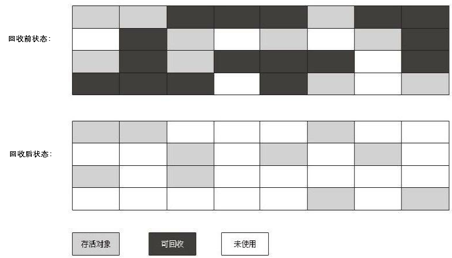
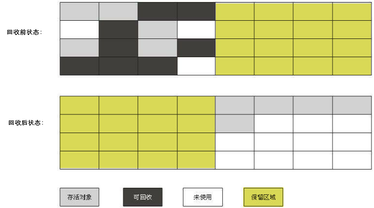
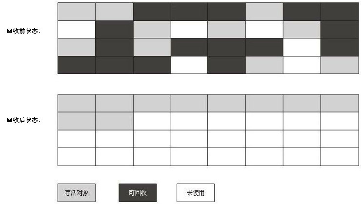
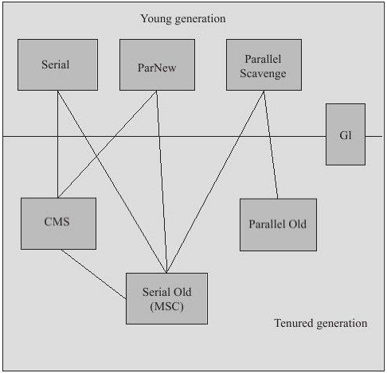
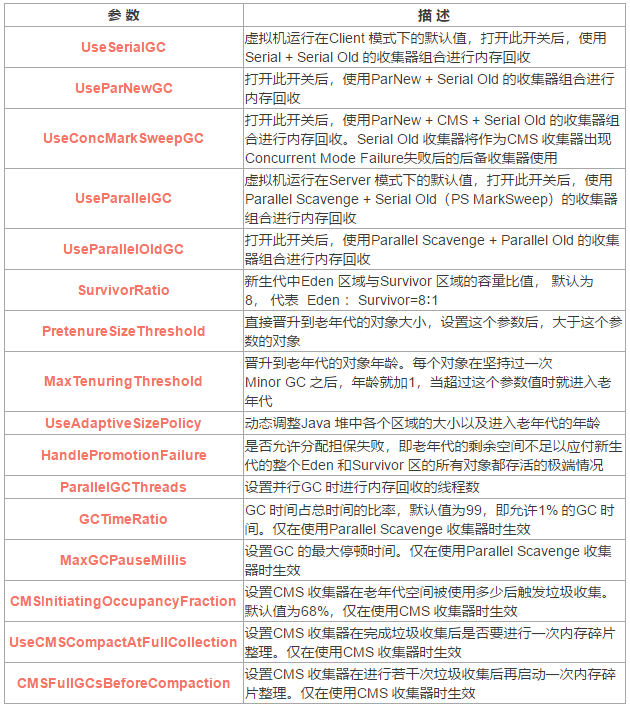

参考书籍：《深入理解Java虚拟机——JVM高级特性与最佳实践(第2版)》

在判定（可以通过引用计数算法或者根搜索算法）完哪些对象还活着，哪些对象可以被回收之后，GC究竟是如何进行垃圾回收的呢？

# 垃圾收集算法

## 标记-清除（Mark-Sweep）算法
标记-清除算法是最基础的收集算法，如同它的名字一样，算法分为标记和清除两个阶段：首先标记出所有需要回收的对象，在标记完成后统一回收所有被标记的对象，标记过程其实就是通过引用计数算法或者根搜索算法来判断对象是否存活。之所以说它是最基础的收集算法，是因为后续的收集算法都是基于这种思路并对其不足进行改进而得到的。它的主要不足有两个：一个是效率问题，标记和清除两个过程的效率都不高；另一个是空间问题，标记清除之后会产生大量不连续的内存碎片，空间碎片太多可能会导致以后在程序运行过程中需要分配较大的对象时，无法找到足够的连续内存而不得不提前触发另一次垃圾收集动作。标记-清除算法的执行过程如下图所示。 

## 复制（Coping）算法
为了解决效率问题，复制算法将可用内存按容量划分为大小相等的两块，每次只使用其中的一块。当这一块的内存用完了，就将还存活着的对象复制到另外一块上面，然后再把这块已使用过的内存空间一次清理掉。这样使得每次都是对整个半区进行内存回收，内存分配时也就不用考虑内存碎片等复杂情况，只要移动堆顶指针，按顺序分配内存即可，实现简单，运行高效。只是这种算法的代价是将内存缩小为了原来的一半，未免太高了一点。复制算法的执行过程如下图所示。 

## 标记-整理（Mark-Compact）算法
复制算法在对象存活率较高时就要进行较多的复制操作，效率将会降低。更关键的是，如果不想浪费50%的空间，就需要有额外的空间进行分配担保（例如，在HotSpot虚拟中，如果Survivor空间没有足够空间存放上一次新生代收集下来的存活对象时，这些对象将直接通过分配担保机制进入老年代），以应对被使用的内存中所有对象都100%存活的极端情况，所以老年代一般不能直接选用复制收集算法。根据老年代的特点，有人提出了另外一种“标记-整理”（Mark-Compact）算法，标记过程仍然与“标记-清除”算法一样，但后续步骤不是直接对可回收对象进行清理，而是让所有存活的对象都向一端移动，然后直接清理掉端边界以外的内存。这种方法既避免了内存碎片的产生，又不会像复制算法那样浪费过多的内存空间。 标记-整理算法示意图如下图所示。 

## 分代收集（Generational Collection）算法
当前商业虚拟机的垃圾收集都采用“分代收集”（Generational Collection）算法，这种算法并没有什么新的思想，只是根据对象存活周期的不同将内存划分为几块。 一般是把Java堆分为新生代和老年代，这样就可以根据各个年代的特点采用最适当的收集算法。 在新生代中，每次垃圾收集时都发现有大批对象死去，只有少量存活，那就选用复制算法，只需要付出少量存活对象的复制成本就可以完成收集。 而老年代中因为对象存活率高、 没有额外空间对它进行分配担保，就必须使用“标记—清理”或者“标记—整理”算法来进行回收。  

# 垃圾收集器
如果说收集算法是内存回收的方法论，那么垃圾收集器就是内存回收的具体实现。Java虚拟机规范中对垃圾收集器应该如何实现并没有任何规定，因此不同的厂商、 不同版本的虚拟机所提供的垃圾收集器都可能会有很大差别，并且一般都会提供参数供用户根据自己的应用特点和要求组合出各个年代所使用的收集器。在此我们对基于JDK 1.7 Update 14之后的HotSpot虚拟机的垃圾收集器进行说明，这个虚拟机包含的所有收集器如下图所示。 

图中展示了7种作用于不同分代的收集器，如果两个收集器之间存在连线，就说明它们可以搭配使用。 虚拟机所处的区域，则表示它是属于新生代收集器还是老年代收集器。 

## Serial收集器
Serial收集器是一个单线程的收集器，但它的“单线程”的意义并不仅仅说明它只会使用一个CPU或一条收集线程去完成垃圾收集工作，更重要的是在它进行垃圾收集时，必须暂停其他所有的工作线程，直到它收集结束，有点类似“Stop The World”。 
下图示意了Serial/Serial Old收集器的运行过程。 

## ParNew收集器
ParNew收集器其实就是Serial收集器的多线程版本，除了使用多条线程进行垃圾收集之外，其余行为包括Serial收集器可用的所有控制参数（例如：-XX：SurvivorRatio、 -XX：

PretenureSizeThreshold、 -XX：HandlePromotionFailure等）、 收集算法、 Stop The World、 对象分配规则、 回收策略等都与Serial收集器完全一样，在实现上，这两种收集器也共用了相当多的代码。 ParNew收集器的工作过程如下图所示。 

并行（Parallel）：指多条垃圾收集线程并行工作，但此时用户线程仍然处于等待状态。

并发（Concurrent）：指用户线程与垃圾收集线程同时执行（但不一定是并行的，可能会交替执行），用户程序在继续运行，而垃圾收集程序运行于另一个CPU上。

## Parallel Scavenge收集器
Parallel Scavenge收集器与ParNew收集器存在很多相似之处，例如：新生代收集器，复制算法、并行的多线程收集器。同其它的收集器相比，Parallel Scavenge收集器的与众不同之处在于，它的运行目标是使系统达到一个可控制的吞吐量（Throughput）。 所谓吞吐量就是CPU用于运行用户代码的时间与CPU总消耗时间的比值，即吞吐量=运行用户代码时间/（运行用户代码时间+垃圾收集时间），虚拟机总共运行了100分钟，其中垃圾收集花掉1分钟，那吞吐量就是99%。

CMS等收集器的目标是尽可能地缩短垃圾收集时用户线程的停顿时间，停顿时间越短就越适合需要与用户交互的程序，良好的响应速度能提升用户体验，而高吞吐量则可以高效率地利用CPU时间，尽快完成程序的运算任务，主要适合在后台运算而不需要太多交互的任务。

Parallel Scavenge收集器提供了两个参数用于精确控制吞吐量，分别是控制最大垃圾收集停顿时间的-XX：MaxGCPauseMillis参数以及直接设置吞吐量大小的-XX：GCTimeRatio参数。

## Serial Old收集器
Serial Old收集器是Serial收集器的老年代版本，它同样是一个单线程收集器，使用“标记-整理”算法。 这个收集器的主要意义也是在于给Client模式下的虚拟机使用。 如果在Server模式下，那么它主要还有两大用途：一种用途是在JDK 1.5以及之前的版本中与Parallel Scavenge收集器搭配使用，另一种用途就是作为CMS收集器的后备预案，在并发收集发生Concurrent Mode Failure时使用。 Serial Old收集器的工作过程如下图所示。

## Parallel Old收集器
Parallel Old是Parallel Scavenge收集器的老年代版本，使用多线程和“标记-整理”算法。

Parallel Scavenge收集器和Parallel Old收集器组合在一起，形成了一个名副其实的“吞吐量优先”的应用组合，在注重吞吐量以及CPU资源敏感的场合，可以考虑优先使用。 Parallel Old收集器的工作过程如下图所示。 

## CMS收集器
CMS（Concurrent Mark Sweep）收集器是一种以获取最短回收停顿时间为目标的收集器，使用“标记-清除”算法。 

CMS收集器的完整运作过程分为以下四个步骤：

- 初始标记（CMS initial mark）
- 并发标记（CMS concurrent mark）
- 重新标记（CMS remark）
- 并发清除（CMS concurrent sweep）

其中，初始标记、 重新标记这两个步骤仍然需要“Stop The World”。 初始标记仅仅只是标记一下GC Roots能直接关联到的对象，速度很快，并发标记阶段就是进行GC RootsTracing的过程，而重新标记阶段则是为了修正并发标记期间因用户程序继续运作而导致标记产生变动的那一部分对象的标记记录，这个阶段的停顿时间一般会比初始标记阶段稍长一些，但远比并发标记的时间短。

由于整个过程中耗时最长的并发标记和并发清除过程收集器线程都可以与用户线程一起工作，所以，从总体上来说，CMS收集器的内存回收过程是与用户线程一起并发执行的。 通过下图可以比较清楚地看到CMS收集器的运作步骤中并发和需要停顿的时间。

## G1 收集器
G1（Garbage-First）收集器是当今收集器技术发展的最前沿成果之一，与其他GC收集器相比，G1具备如下特点：

并行与并发：G1能充分利用多CPU、 多核环境下的硬件优势，使用多个CPU（CPU或者CPU核心）来缩短Stop-The-World停顿的时间，部分其他收集器原本需要停顿Java线程执行的GC动作，G1收集器仍然可以通过并发的方式让Java程序继续执行。
分代收集：与其他收集器一样，分代概念在G1中依然得以保留。 虽然G1可以不需要其他收集器配合就能独立管理整个GC堆，但它能够采用不同的方式去处理新创建的对象和已经存活了一段时间、 熬过多次GC的旧对象以获取更好的收集效果。
空间整合：与CMS的“标记—清理”算法不同，G1从整体来看是基于“标记—整理”算法实现的收集器，从局部（两个Region之间）上来看是基于“复制”算法实现的，但无论如何，这两种算法都意味着G1运作期间不会产生内存空间碎片，收集后能提供规整的可用内存。 这种特性有利于程序长时间运行，分配大对象时不会因为无法找到连续内存空间而提前触发下一次GC。
可预测的停顿：这是G1相对于CMS的另一大优势，降低停顿时间是G1和CMS共同的关注点，但G1除了追求低停顿外，还能建立可预测的停顿时间模型，能让使用者明确指定在一个长度为M毫秒的时间片段内，消耗在垃圾收集上的时间不得超过N毫秒，这几乎已经是实时Java（RTSJ）的垃圾收集器的特征了。
在G1之前的其他收集器进行收集的范围都是整个新生代或者老年代，而G1不再是这样。 使用G1收集器时，Java堆的内存布局就与其他收集器有很大差别，它将整个Java堆划分为多个大小相等的独立区域（Region），虽然还保留有新生代和老年代的概念，但新生代和老年代不再是物理隔离的了，它们都是一部分Region（不需要连续）的集合。

G1收集器之所以能建立可预测的停顿时间模型，是因为它可以有计划地避免在整个Java堆中进行全区域的垃圾收集。 G1跟踪各个Region里面的垃圾堆积的价值大小（回收所获得的空间大小以及回收所需时间的经验值），在后台维护一个优先列表，每次根据允许的收集时间，优先回收价值最大的Region（这也就是Garbage-First名称的来由）。 这种使用Region划分内存空间以及有优先级的区域回收方式，保证了G1收集器在有限的时间内可以获取尽可能高的收集效率。

在G1收集器中，Region之间的对象引用以及其他收集器中的新生代与老年代之间的对象引用，虚拟机都是使用Remembered Set来避免全堆扫描的。 G1中每个Region都有一个与之对应的Remembered Set，虚拟机发现程序在对Reference类型的数据进行写操作时，会产生一个Write Barrier暂时中断写操作，检查Reference引用的对象是否处于不同的Region之中，如果是，便通过CardTable把相关引用信息记录到被引用对象所属的Region的Remembered Set之中。 当进行内存回收时，在GC根节点的枚举范围中加入Remembered Set即可保证不对全堆扫描也不会有遗漏。

如果不计算维护Remembered Set的操作，G1收集器的运作大致可划分为以下几个步骤：

- 初始标记（Initial Marking）
- 并发标记（Concurrent Marking）
- 最终标记（Final Marking）
- 筛选回收（Live Data Counting and Evacuation）

初始标记阶段仅仅只是标记一下GC Roots能直接关联到的对象，并且修改TAMS（Next Top at Mark Start）的值，让下一阶段用户程序并发运行时，能在正确可用的Region中创建新对象，这阶段需要停顿线程，但耗时很短。 并发标记阶段是从GC Root开始对堆中对象进行可达性分析，找出存活的对象，这阶段耗时较长，但可与用户程序并发执行。 而最终标记阶段则是为了修正在并发标记期间因用户程序继续运作而导致标记产生变动的那一部分标记记录，虚拟机将这段时间对象变化记录在线程Remembered Set Logs里面，最终标记阶段需要把Remembered Set Logs的数据合并到Remembered Set中，这阶段需要停顿线程，但是可并行执行。 最后在筛选回收阶段首先对各个Region的回收价值和成本进行排序，根据用户所期望的GC停顿时间来制定回收计划，从Sun公司透露出来的信息来看，这个阶段其实也可以做到与用户程序一起并发执行，但是因为只回收一部分Region，时间是用户可控制的，而且停顿用户线程将大幅提高收集效率。 通过下图可以比较清楚地看到G1收集器的运作步骤中并发和需要停顿的阶段。

垃圾收集相关的常用参数 

