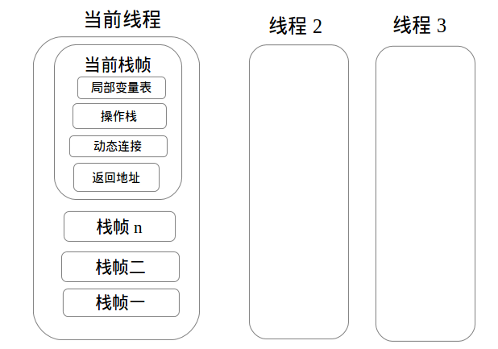
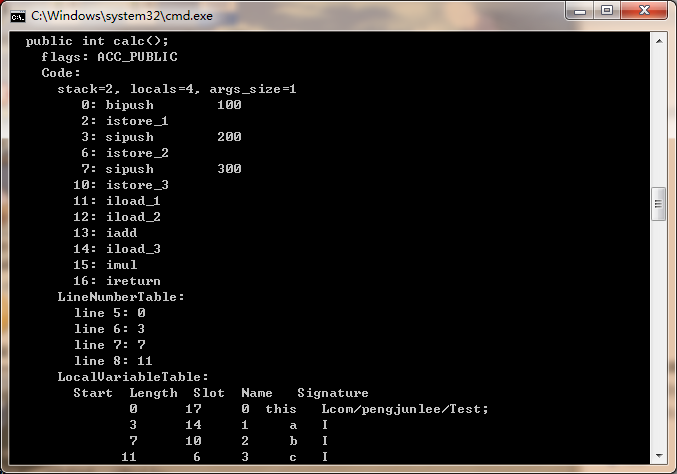
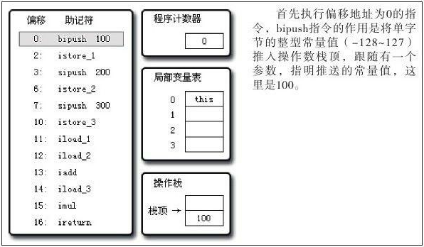
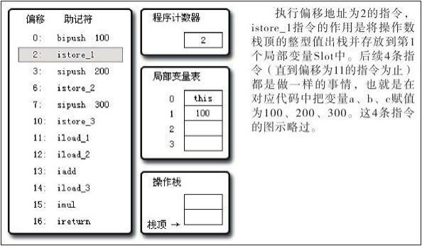
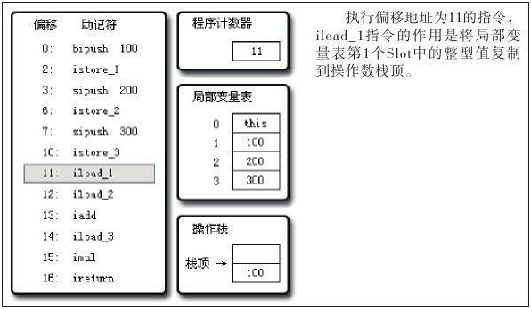
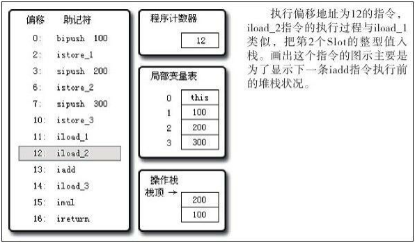
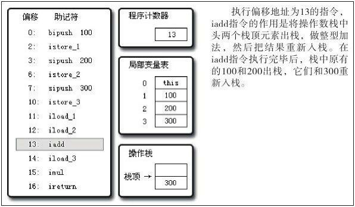
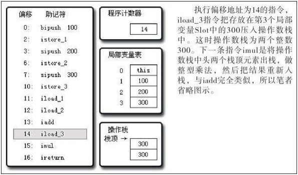
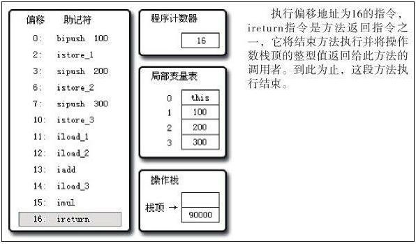

参考书籍：《深入理解Java虚拟机——JVM高级特性与最佳实践(第2版)》

知识点回顾：javac编译器通过对程序代码进行词法分析、语法分析、生成抽象语法树、遍历抽象语法树等复杂的编译过程，最终，将程序代码变成了Class字节码文件。然后，生成的Class字节码文件在经历过加载、验证、准备、解析、初始化等阶段之后才能被使用/卸载。

# 运行时栈帧结构
栈帧（Stack Frame）是用于支持虚拟机进行方法调用和方法执行的数据结构，它是虚拟机运行时数据区中的虚拟机栈（Virtual Machine Stack）的栈元素。 栈帧存储了方法的局部变量表、 操作数栈、 动态连接和方法返回地址等信息。 每一个方法从调用开始至执行完成的过程，都对应着一个栈帧在虚拟机栈里面从入栈到出栈的过程。

一个线程中的方法调用链可能会很长，很多方法都同时处于执行状态。 对于执行引擎来说，在活动线程中，只有位于栈顶的栈帧才是有效的，称为当前栈帧（Current StackFrame），与这个栈帧相关联的方法称为当前方法（Current Method）。 执行引擎运行的所有字节码指令都只针对当前栈帧进行操作，在概念模型上，典型的栈帧结构如下图所示。 

## 局部变量表
局部变量表（Local Variable Table）是一组变量值存储空间，用于存放方法参数和方法内部定义的局部变量。 在Java程序编译为Class文件时，就在方法的Code属性的max_locals数据项中确定了该方法所需要分配的局部变量表的最大容量。

局部变量表的容量以变量槽（Variable Slot，下称Slot）为最小单位，在基本数据类型中，64 位长度的long 和double 类型的数据会占用2 个连续局部变量空间（高位对齐），其余的数据类型只占用1 个。由于局部变量表建立在线程的堆栈上，是线程私有的数据，无论读写两个连续的Slot是否为原子操作，都不会引起数据安全问。

在方法执行时，虚拟机是使用局部变量表完成参数值到参数变量列表的传递过程的，如果执行的是实例方法（非static的方法），那局部变量表中第0位索引的Slot默认是用于传递方法所属对象实例的引用，在方法中可以通过关键字“this”来访问到这个隐含的参数。 其余参数则按照参数表顺序排列，占用从1开始的局部变量Slot，参数表分配完毕后，再根据方法体内部定义的变量顺序和作用域分配其余的Slot。

为了尽可能节省栈帧空间，局部变量表中的Slot是可以重用的，方法体中定义的变量，其作用域并不一定会覆盖整个方法体，如果当前字节码PC计数器的值已经超出了某个变量的作用域，那这个变量对应的Slot就可以交给其他变量使用。在某些情况下，Slot的复用会影响垃圾收集器的行为，例如：被复用的Slot中所引用的变量在超出变量的作用域后，但该Slot空间还没有被其他变量所占用，会导致作为GC Roots一部分的局部变量表仍然保持着对旧变量的关联，进而导致旧变量无法被回收。  

## 操作数栈
操作数栈（Operand Stack）也常称为操作栈，它是一个后入先出（Last In First Out,LIFO）栈。 同局部变量表一样，操作数栈的最大深度也在编译的时候写入到Code属性的max_stacks数据项中。 操作数栈的每一个元素可以是任意的Java数据类型，包括long和double。 32位数据类型所占的栈容量为1，64位数据类型所占的栈容量为2。 在方法执行的任何时候，操作数栈的深度都不会超过在max_stacks数据项中设定的最大值。

当一个方法刚刚开始执行的时候，这个方法的操作数栈是空的，在方法的执行过程中，会有各种字节码指令往操作数栈中写入和提取内容，也就是出栈/入栈操作，而且操作数栈中元素的数据类型必须与字节码指令的序列严格匹配。

举个例子，整数加法的字节码指令iadd在运行的时候操作数栈中最接近栈顶的两个元素已经存入了两个int型的数值，当执行这个指令时，会将这两个int值出栈并相加，然后将相加的结果入栈。 

## 动态连接
每个栈帧都包含一个指向运行时常量池中该栈帧所属方法的引用，持有这个引用是为了支持方法调用过程中的动态连接（Dynamic Linking）。 Class文件的常量池中存有大量的符号引用，字节码中的方法调用指令就以常量池中指向方法的符号引用作为参数。 这些符号引用一部分会在类加载阶段或者第一次使用的时候就转化为直接引用，这种转化称为静态解析。 另外一部分将在每一次运行期间转化为直接引用，这部分称为动态连接。 

## 方法返回地址
当一个方法开始执行后，只有两种方式可以退出这个方法。 第一种方式是执行引擎遇到任意一个方法返回的字节码指令，这时候可能会有返回值传递给上层的方法调用者（调用当前方法的方法称为调用者），是否有返回值和返回值的类型将根据遇到何种方法返回指令来决定，这种退出方法的方式称为正常完成出口（Normal Method Invocation Completion）。

另外一种退出方式是，在方法执行过程中遇到了异常，并且这个异常没有在方法体内得到处理，无论是Java虚拟机内部产生的异常，还是代码中使用athrow字节码指令产生的异常，只要在本方法的异常表中没有搜索到匹配的异常处理器，就会导致方法退出，这种退出方法的方式称为异常完成出口（Abrupt Method Invocation Completion）。 一个方法使用异常完成出口的方式退出，是不会给它的上层调用者产生任何返回值的。

无论采用何种退出方式，在方法退出之后，都需要返回到方法被调用的位置，程序才能继续执行，方法退出的过程实际上就等同于把当前栈帧出栈，因此退出时可能执行的操作有：恢复上层方法的局部变量表和操作数栈，把返回值（如果有的话）压入调用者栈帧的操作数栈中，调整PC计数器的值以指向方法调用指令后面的一条指令等。

# 方法调用
方法调用并不等同于方法执行，方法调用阶段唯一的任务就是确定被调用方法的版本（即调用哪一个方法），暂时还不涉及方法内部的具体运行过程。

Class文件的编译过程中不包含传统编译中的连接步骤，一切方法调用在Class文件里面存储的都只是符号引用，而不是方法在实际运行时内存布局中的入口地址（相当于之前说的直接引用）。 这个特性给Java带来了更强大的动态扩展能力，但也使得Java方法调用过程变得相对复杂起来，需要在类加载期间，甚至到运行期间才能确定目标方法的直接引用。

## 解析
所有方法调用中的目标方法在Class文件里面都是一个常量池中的符号引用，在类加载的解析阶段，会将其中的一部分符号引用转化为直接引用，这种解析能成立的前提是：方法在程序真正运行之前就有一个可确定的调用版本，并且这个方法的调用版本在运行期是不可改变的。 换句话说，调用目标在程序代码写好、 编译器进行编译时就必须确定下来。 这类方法的调用称为解析（Resolution）。

在Java语言中符合“编译期可知，运行期不可变”这个要求的方法，主要包括静态方法和私有方法两大类，前者与类型直接关联，后者在外部不可被访问，这两种方法各自的特点决定了它们都不可能通过继承或别的方式重写其他版本，因此它们都适合在类加载阶段进行解析。

与之相对应的是，在Java虚拟机里面提供了5条方法调用字节码指令，分别如下。

- invokestatic：调用静态方法。
- invokespecial：调用实例构造器＜init＞方法、 私有方法和父类方法。
- invokevirtual：调用所有的虚方法。
- invokeinterface：调用接口方法，会在运行时再确定一个实现此接口的对象。
- invokedynamic：先在运行时动态解析出调用点限定符所引用的方法，然后再执行该方法，在此之前的4条调用指令，分派逻辑是固化在Java虚拟机内部的，而invokedynamic指令的分派逻辑是由用户所设定的引导方法决定的。

只要能被invokestatic和invokespecial指令调用的方法，都可以在解析阶段中确定唯一的调用版本，符合这个条件的有静态方法、 私有方法、 实例构造器、 父类方法4类，它们在类加载的时候就会把符号引用解析为该方法的直接引用。 这些方法可以称为非虚方法，与之相反，其他方法称为虚方法（除去final方法）。 

Java中的非虚方法除了使用invokestatic、 invokespecial调用的方法之外还有一种，就是被final修饰的方法。 虽然final方法是使用invokevirtual指令来调用的，但是由于它无法被覆盖，没有其他版本，所以也无须对方法接收者进行多态选择，又或者说多态选择的结果肯定是唯一的。

解析调用一定是个静态的过程，在编译期间就完全确定，在类装载的解析阶段就会把涉及的符号引用全部转变为可确定的直接引用，不会延迟到运行期再去完成。 

## 分派
### 静态分派
Object obj=new String();
形如上面这行代码，我们把代码中的“Object ”称为变量的静态类型（Static Type），或者叫做的外观类型（Apparent Type），后面的“String”则称为变量的实际类型（Actual Type）。

静态类型和实际类型的区别在于：一个变量的静态类型是不会被改变的，并且其最终的静态类型是在编译期可知的；而实际类型变化的结果要到运行期才能确定，编译器在编译程序的时候并不知道一个对象的实际类型是什么。  

虚拟机（准确地说是编译器）在重载方法选择时是通过参数的静态类型而不是实际类型作为判定依据的，我们把这种依赖静态类型来定位方法执行版本的分派动作称为静态分派。 

	/**
	 * 方法静态分派演示
	 */
	public class StaticDispatch {
		static abstract class Human {
		}
	 
		static class Man extends Human {
		}
	 
		static class Woman extends Human {
		}
	 
		public void sayHello(Human guy) {
			System.out.println("hello,guy！");
		}
	 
		public void sayHello(Man guy) {
			System.out.println("hello,gentleman！");
		}
	 
		public void sayHello(Woman guy) {
			System.out.println("hello,lady！");
		}
	 
		public static void main(String[] args) {
			Human man = new Man();
			Human woman = new Woman();
			StaticDispatch sr = new StaticDispatch();
			sr.sayHello(man);
			sr.sayHello(woman);
		}
	}

### 动态分派
所有依赖实际类型来定位方法执行版本的分派动作称为动态分派，比较典型的一个体现就是重写（Override）。 

	/**
	 * 方法动态分派演示
	 */
	public class DynamicDispatch {
		static abstract class Human {
			protected abstract void sayHello();
		}
	 
		static class Man extends Human {
			@Override
			protected void sayHello() {
				System.out.println("man say hello");
			}
		}
	 
		static class Woman extends Human {
			@Override
			protected void sayHello() {
				System.out.println("woman say hello");
			}
		}
	 
		public static void main(String[] args) {
			Human man = new Man();
			Human woman = new Woman();
			man.sayHello();
			woman.sayHello();
			man = new Woman();
			man.sayHello();
		}
	}

### 单分派与多分派
方法的接收者与方法的参数统称为方法的宗量，根据分派基于多少种宗量，可以将分派划分为单分派和多分派两种。单分派是根据一个宗量对目标方法进行选择，多分派则是根据多于一个宗量对目标方法进行选择。

基于栈的解释器执行过程
通过一段Java代码，看看在虚拟机中实际是如何执行的。

	package com.pengjunlee;
	 
	public class Test {
		public int calc() {
			int a = 100;
			int b = 200;
			int c = 300;
			return (a + b) * c;
		}
	}

使用javap命令看看它的字节码指令，如下图所示。 

javap提示这段代码需要深度为2的操作数栈和4个Slot的局部变量空间，下面的7张图，用它们来描述代码执行过程中的指令、 操作数栈和局部变量表的变化情况。 

