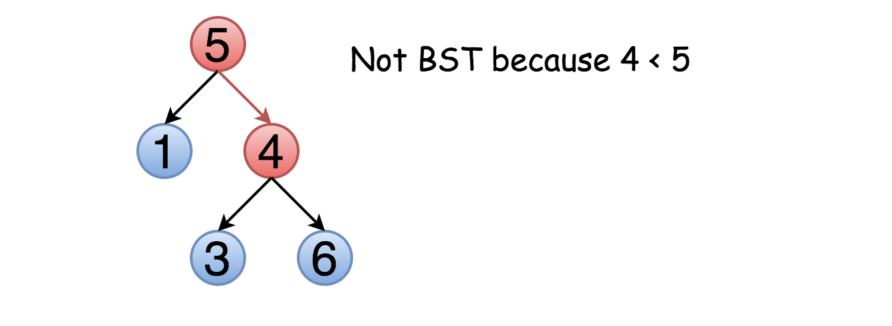
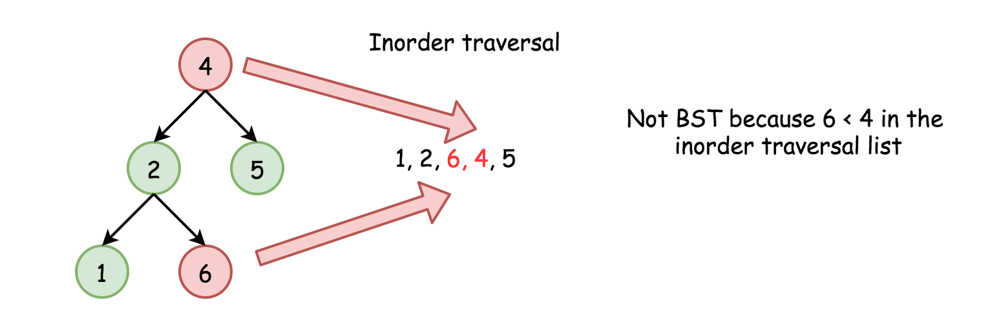

给定一个二叉树，判断其是否是一个有效的二叉搜索树。

假设一个二叉搜索树具有如下特征：

- 节点的左子树只包含小于当前节点的数。
- 节点的右子树只包含大于当前节点的数。
- 所有左子树和右子树自身必须也是二叉搜索树。

**示例 1**:

	输入:
	    2
	   / \
	  1   3
	输出: true

**示例 2**:

	输入:
	    5
	   / \
	  1   4
	     / \
	    3   6
	输出: false
	解释: 输入为: [5,1,4,null,null,3,6]。
	     根节点的值为 5 ，但是其右子节点值为 4 。

**树的定义**：

	// Definition for a binary tree node.
	public class TreeNode {
	  int val;
	  TreeNode left;
	  TreeNode right;
	 
	  TreeNode(int x) {
	    val = x;
	  }
	}

**直觉** 乍一看，这是一个平凡的问题。只需要遍历整棵树，检查 `node.right.val` > `node.val` 和
`node.left.val` < `node.val` 对每个结点是否成立。

问题是，这种方法并不总是正确。不仅右子结点要大于该节点，整个右子树的元素都应该大于该节点。例如:

这意味着我们需要在遍历树的同时保留结点的上界与下界，在比较时不仅比较子结点的值，也要与上下界比较。

# 方法一: 递归
上述思路可以用递归法实现。首先将结点的值与上界和下界（如果有）比较。然后，对左子树和右子树递归进行该过程。

	class Solution {
	  public boolean helper(TreeNode node, Integer lower, Integer upper) {
	    if (node == null) return true;
	 
	    int val = node.val;
	    if (lower != null && val <= lower) return false;
	    if (upper != null && val >= upper) return false;
	 
	    if (! helper(node.right, val, upper)) return false;
	    if (! helper(node.left, lower, val)) return false;
	    return true;
	  }
	 
	  public boolean isValidBST(TreeNode root) {
	    return helper(root, null, null);
	  }
	}

**复杂度分析**

- 时间复杂度 : O(N)。每个结点访问一次。
- 空间复杂度 : O(N)。我们跟进了整棵树。

# 方法二: 迭代
通过使用栈，上面的递归法可以转化为迭代法。这里使用深度优先搜索，比广度优先搜索要快一些。

	class Solution {
	  LinkedList<TreeNode> stack = new LinkedList();
	  LinkedList<Integer> uppers = new LinkedList(),
	          lowers = new LinkedList();
	 
	  public void update(TreeNode root, Integer lower, Integer upper) {
	    stack.add(root);
	    lowers.add(lower);
	    uppers.add(upper);
	  }
	 
	  public boolean isValidBST(TreeNode root) {
	    Integer lower = null, upper = null, val;
	    update(root, lower, upper);
	 
	    while (!stack.isEmpty()) {
	      root = stack.poll();
	      lower = lowers.poll();
	      upper = uppers.poll();
	 
	      if (root == null) continue;
	      val = root.val;
	      if (lower != null && val <= lower) return false;
	      if (upper != null && val >= upper) return false;
	      update(root.right, val, upper);
	      update(root.left, lower, val);
	    }
	    return true;
	  }
	}

**复杂度分析**

- 时间复杂度 : O(N)。每个结点访问一次。
- 空间复杂度 : O(N)。我们跟进了整棵树。

# 方法三：中序遍历

上面的结点按照访问的顺序标号，你可以按照`1-2-3-4-5`的顺序来比较不同的策略。

`左子树` -> `结点` -> `右子树` 意味着对于二叉搜索树而言，每个元素都应该比下一个元素小。

因此，具有 `{O}(N)O(N)` 时间复杂度与 `{O}(N)O(N)` 空间复杂度的算法十分简单:

- 计算中序遍历列表 inorder。
- 检查 inorder中的每个元素是否小于下一个。

**我们需要保留整个inorder列表吗**？

事实上不需要。每一步最后一个添加的元素就足以保证树是（或不是）二叉搜索树。因此，我们可以将步骤整合并复用空间。

	class Solution {
	  public boolean isValidBST(TreeNode root) {
	    Stack<TreeNode> stack = new Stack();
	    double inorder = - Double.MAX_VALUE;
	 
	    while (!stack.isEmpty() || root != null) {
	      while (root != null) {
	        stack.push(root);
	        root = root.left;
	      }
	      root = stack.pop();
	      // If next element in inorder traversal
	      // is smaller than the previous one
	      // that's not BST.
	      if (root.val <= inorder) return false;
	      inorder = root.val;
	      root = root.right;
	    }
	    return true;
	  }
	}

**复杂度分析**

- 时间复杂度 : 最坏情况下（树为二叉搜索树或破坏条件的元素是最右叶结点）为 O(N)。
- 空间复杂度 : O(N) 用于存储 stack。