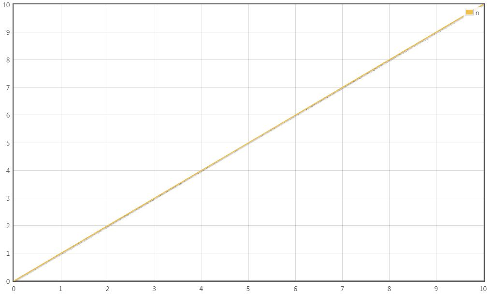
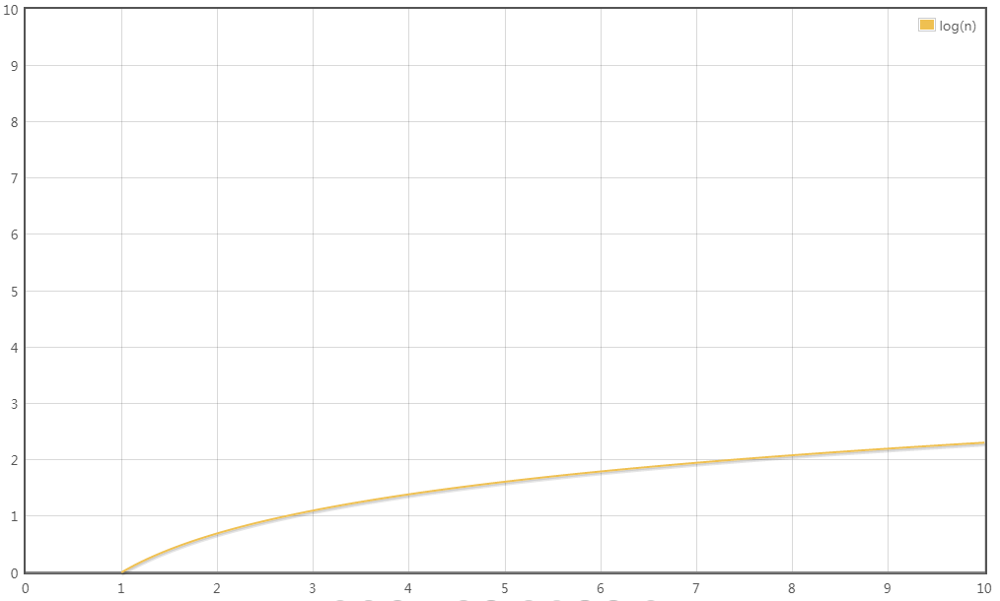
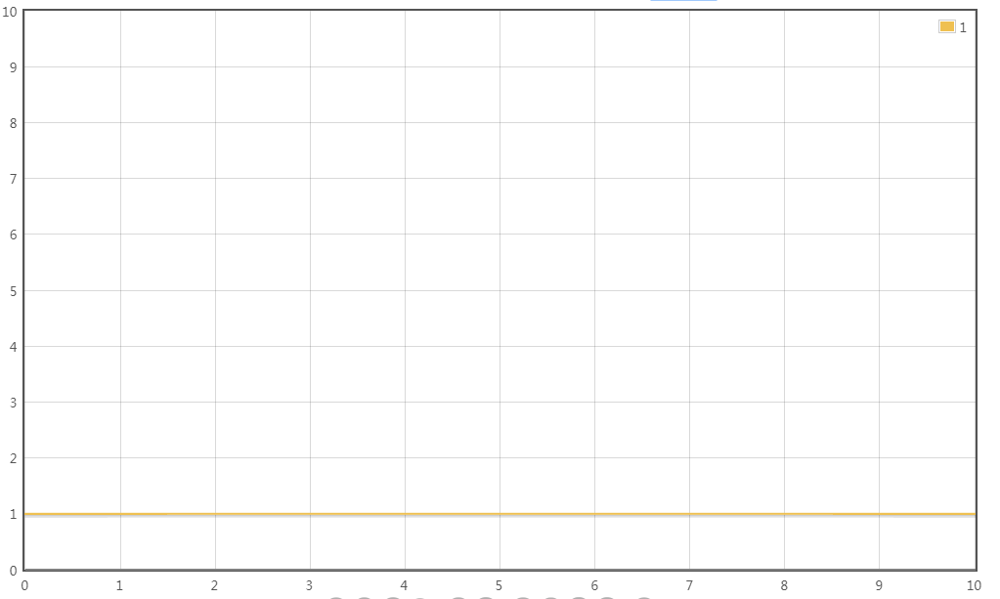
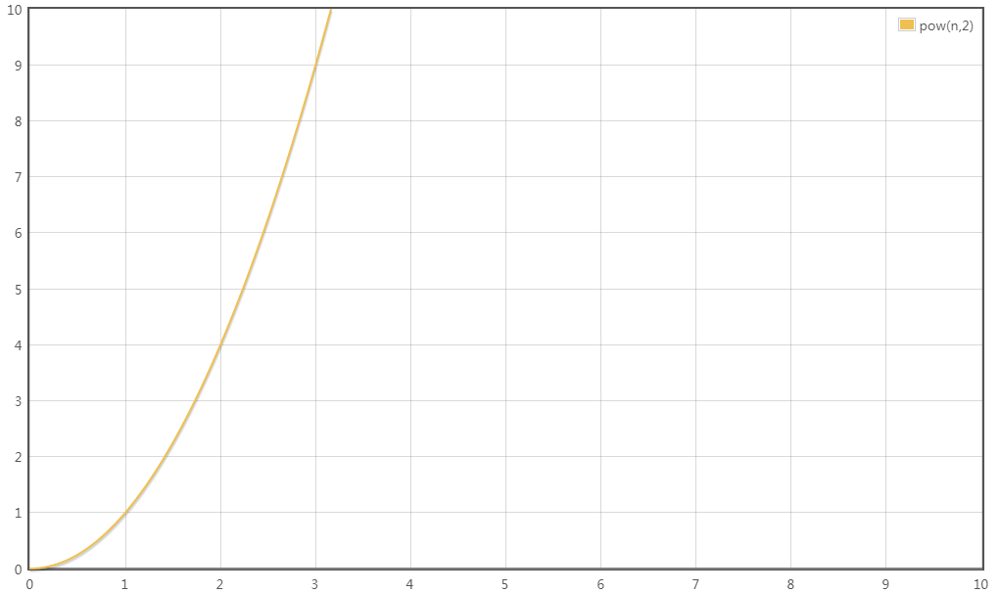
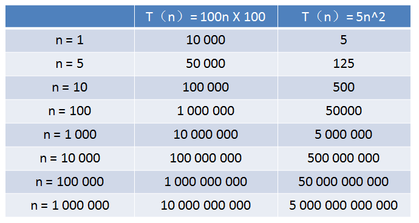

> 原文地址：<https://blog.csdn.net/qq_41523096/article/details/82142747>

# 时间复杂度的意义
究竟什么是时间复杂度呢？让我们来想象一个场景：某一天，小灰和大黄同时加入了一个公司......

一天过后，小灰和大黄各自交付了代码，两端代码实现的功能都差不多。大黄的代码运行一次要花100毫秒，内存占用5MB。小灰的代码运行一次要花100秒，内存占用500MB。于是......

由此可见，衡量代码的好坏，包括两个非常重要的指标：

1. 运行时间
2. 占用空间

# 基本操作执行次数
关于代码的基本操作执行次数，我们用四个生活中的场景，来做一下比喻：

**场景1**：给小灰一条长10寸的面包，小灰每3天吃掉1寸，那么吃掉整个面包需要几天？

答案自然是 `3 X 10 = 30`天。

如果面包的长度是`N`寸呢？

此时吃掉整个面包，需要`3 X n = 3n`天。

如果用一个函数来表达这个相对时间，可以记作` T（n） = 3n`。

**场景2**：给小灰一条长16寸的面包，小灰每5天吃掉面包剩余长度的一半，第一次吃掉8寸，第二次吃掉4寸，第三次吃掉2寸......那么小灰把面包吃得只剩下1寸，需要多少天呢？

这个问题翻译一下，就是数字16不断地除以2，除几次以后的结果等于1？这里要涉及到数学当中的对数，以2位底，16的对数，可以简写为log16。

因此，把面包吃得只剩下1寸，需要`5 X log16 = 5 X 4 = 20`天。

如果面包的长度是`N`寸呢？

需要`5 X logn = 5logn`天，记作`T（n） = 5logn`。

**场景3**：给小灰一条长10寸的面包和一个鸡腿，小灰每2天吃掉一个鸡腿。那么小灰吃掉整个鸡腿需要多少天呢？

答案自然是2天。因为只说是吃掉鸡腿，和10寸的面包没有关系 。

如果面包的长度是`N`寸呢？

无论面包有多长，吃掉鸡腿的时间仍然是2天，记作`T（n） = 2`。

**场景4**：给小灰一条长10寸的面包，小灰吃掉第一个一寸需要1天时间，吃掉第二个一寸需要2天时间，吃掉第三个一寸需要3天时间.....每多吃一寸，所花的时间也多一天。那么小灰吃掉整个面包需要多少天呢？

答案是从1累加到10的总和，也就是55天。

如果面包的长度是`N`寸呢？

此时吃掉整个面包，需要`1+2+3+......+ n-1 + n = (1+n)*n/2 = 0.5n^2 + 0.5n`。

记作`T（n） = 0.5n^2 + 0.5n`。

上面所讲的是吃东西所花费的相对时间，这一思想同样适用于对程序基本操作执行次数的统计。刚才的四个场景，分别对应了程序中最常见的四种执行方式：

**场景1**：`T（n） = 3n`，执行次数是线性的。

	void eat1(int n){
	    for(int i=0; i<n; i++){;
	        System.out.println("等待一天");
	        System.out.println("等待一天");
	        System.out.println("吃一寸面包");
	    }
	}

**场景2**：`T（n） = 5logn`，执行次数是对数的。

	void eat2(int n){
	   for(int i=1; i<n; i*=2){
	       System.out.println("等待一天");
	       System.out.println("等待一天");
	       System.out.println("等待一天");
	       System.out.println("等待一天");
	       System.out.println("吃一半面包");
	   }
	}

**场景3**：`T（n） = 2`，执行次数是常量的。

	void eat3(int n){
	   System.out.println("等待一天");
	   System.out.println("吃一个鸡腿");
	}

**场景4**：`T（n） = 0.5n^2 + 0.5n`，执行次数是一个多项式。

	void eat4(int n){
	   for(int i=0; i<n; i++){
	       for(int j=0; j<i; j++){
	           System.out.println("等待一天");
	       }
	       System.out.println("吃一寸面包");
	   }
	}

# 渐进时间复杂度
有了基本操作执行次数的函数`T（n）`，是否就可以分析和比较一段代码的运行时间了呢？还是有一定的困难。

比如算法A的相对时间是`T（n）= 100n`，算法B的相对时间是`T（n）= 5n^2`，这两个到底谁的运行时间更长一些？这就要看n的取值了。

所以，这时候有了渐进时间复杂度（asymptotic time complexity）的概念，官方的定义如下：

若存在函数 `f（n）`，使得当n趋近于无穷大时，`T（n）/ f（n）`的极限值为不等于零的常数，则称 `f（n）`是`T（n）`的同数量级函数。

记作`T（n）= O（f（n））`，称`O（f（n））`为算法的渐进时间复杂度，简称时间复杂度。

渐进时间复杂度用大写O来表示，所以也被称为大O表示法。

如何推导出时间复杂度呢？有如下几个原则：

- 如果运行时间是常数量级，用常数1表示；
- 只保留时间函数中的最高阶项；
- 如果最高阶项存在，则省去最高阶项前面的系数。

让我们回头看看刚才的四个场景。

**场景1**：

`T（n） = 3n `

最高阶项为3n，省去系数3，转化的时间复杂度为：

`T（n） =  O（n）`

**场景2**：

`T（n） = 5logn `

最高阶项为5logn，省去系数5，转化的时间复杂度为：

`T（n） =  O（logn）`

**场景3**：

`T（n） = 2`

只有常数量级，转化的时间复杂度为：

`T（n） =  O（1）`

**场景4**：

`T（n） = 0.5n^2 + 0.5n`

最高阶项为0.5n^2，省去系数0.5，转化的时间复杂度为：

`T（n） =  O（n^2）`

这四种时间复杂度究竟谁用时更长，谁节省时间呢？稍微思考一下就可以得出结论：

`O（1）`< `O（logn）`<` O（n）`< `O（n^2）`

在编程的世界中有着各种各样的算法，除了上述的四个场景，还有许多不同形式的时间复杂度，比如：

`O（nlogn）`, `O（n^3）`, `O（m*n）`，`O（2^n）`，`O（n！）`

今后遨游在代码的海洋里，我们会陆续遇到上述时间复杂度的算法。

# 时间复杂度的巨大差异

我们来举过一个栗子：

算法A的相对时间规模是`T（n）= 100n`，时间复杂度是`O(n)`

算法B的相对时间规模是`T（n）= 5n^2`，时间复杂度是`O(n^2)`

算法A运行在小灰家里的老旧电脑上，算法B运行在某台超级计算机上，运行速度是老旧电脑的100倍。

那么，随着输入规模`n`的增长，两种算法谁运行更快呢？

从表格中可以看出，当n的值很小的时候，算法A的运行用时要远大于算法B；当n的值达到1000左右，算法A和算法B的运行时间已经接近；当n的值越来越大，达到十万、百万时，算法A的优势开始显现，算法B则越来越慢，差距越来越明显。

这就是不同时间复杂度带来的差距。

