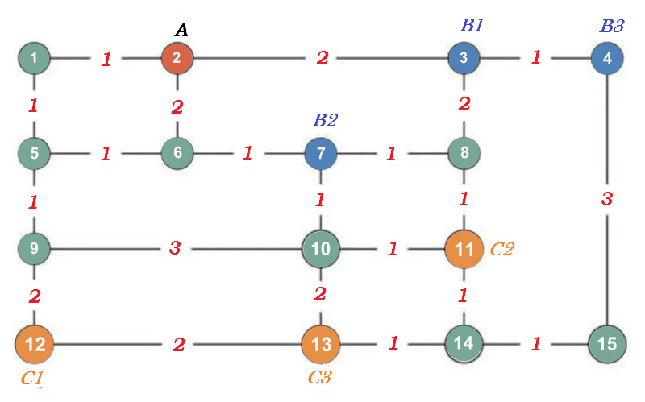

附图中有一个无向图，其中圈内数字代表一个地点，边`e`上数字代表长度`Le`（双向相同）。一位外卖小哥在起点`A`，要去`3`个商家`（B1，B2，B3）`取餐，送到**3**个对应的地方`（C1，C2，C3）`，即` B1`至`C1`，`B2`至`C2`，`B3`至`C3`。小哥的电动助力车的箱子同时最多装下**2**份外卖。

请问：小哥该怎么走路径最短？这个最短路径的长度是多少？这里，`A`是出发点，最后一餐（不限次序）送达地为终点。为了简化问题，假设商家已经备好了外卖，小哥取餐送餐不用等。又假设每份外卖重量大小一样。

我的解题思路是：先写一个方法用来求出任意两个地点之间的最短路径，然后再对取快递和送快递可能出现的不同次序的情况进行穷举，挨个求出每种情况的路径总长度，从中取出路径总长度最短的路径。

	import java.util.HashMap;
	import java.util.Map;
	 
	/**
	 * 地点
	 */
	public class Location {
	 
		// 地点编号
		private Integer id;
	 
		// 该地点可以到达的其他地点及其距离<可以到达的地点编号,到达该地点的距离>
		private Map<Integer, Integer> reachMap = new HashMap<Integer, Integer>();
	 
		// 此处省略get和set方法
	 
		@Override
		public String toString() {
			return "地点编号：" + id;
		}
	 
		@Override
		public boolean equals(Object obj) {
			Location that = (Location) obj;
			return this.id == that.id;
		}
	}
 

	import java.util.ArrayList;
	import java.util.HashSet;
	import java.util.List;
	import java.util.Set;
	 
	/**
	 * 外卖路线
	 */
	public class Route implements Comparable<Route> {
	 
		// 路线总距离
		private Integer distance = 0;
	 
		// 路线经过的地点
		private List<Location> locations = new ArrayList<Location>();
	 
		// 路线已经经过的地点，去重用，防止出现死循环
		private Set<Location> passedLocations = new HashSet<Location>();
	 
		// 此处省略get和set方法
	 
		@Override
		public String toString() {
			Integer size = locations.size();
			String str = "从位置[ " + locations.get(0) + " ]到位置[ " + locations.get(size - 1) + " ]路线距离：" + distance + "\n"
					+ "路线如下：" + "\n";
			for (int i = 0; i < size; i++) {
				str += "-->" + locations.get(i).getId().toString();
			}
			return str;
		}
	 
		@Override
		public int compareTo(Route that) {
			return this.distance - that.distance;
		}
	}
 

	import java.util.ArrayList;
	import java.util.List;
	 
	/**
	 * 外卖的取/送策略
	 */
	public class DeliveryStrategy implements Comparable<DeliveryStrategy> {
	 
		// 外卖的取/送顺序
		private List<Integer> locationsOrder = new ArrayList<Integer>();
	 
		// 当前已经领取，但还未送出的外卖地点编号列表
		private List<Integer> fetchedLocations = new ArrayList<Integer>();
	 
		// 待领取的外卖地点编号列表
		private List<Integer> locations2Fetch = new ArrayList<Integer>();
	 
		// 还未送达的外卖地点编号列表
		private List<Integer> locations2Send = new ArrayList<Integer>();
	 
		// 该策略最短路线的路程
		private Integer distance = 0;
	 
		// 此处省略get和set方法
	 
		@Override
		public int compareTo(DeliveryStrategy that) {
			return this.distance - that.distance;
		}
	 
		@Override
		public String toString() {
			String str = "策略：\n";
			for (Integer index : locationsOrder) {
				str += "==>" + index;
			}
	 
			return str;
		}
	}
 

	import java.util.ArrayList;
	import java.util.Collections;
	import java.util.HashMap;
	import java.util.HashSet;
	import java.util.Iterator;
	import java.util.List;
	import java.util.Map;
	import java.util.Map.Entry;
	import java.util.Set;
	 
	public class MainClass {
	 
		// 最多一次性取几个外卖
		public static Integer deliverCount = 2;
	 
		// 所有的地点数据信息
		public Map<Integer, Location> locations = new HashMap<Integer, Location>();
	 
		// 初始化地点数据信息
		public void initLocations() {
			Location l1 = new Location();
			l1.setId(1);
			l1.getReachMap().put(2, 1);
			l1.getReachMap().put(5, 1);
	 
			Location l2 = new Location();
			l2.setId(2);
			l2.getReachMap().put(1, 1);
			l2.getReachMap().put(3, 2);
			l2.getReachMap().put(6, 2);
	 
			Location l3 = new Location();
			l3.setId(3);
			l3.getReachMap().put(2, 2);
			l3.getReachMap().put(4, 1);
			l3.getReachMap().put(8, 2);
	 
			Location l4 = new Location();
			l4.setId(4);
			l4.getReachMap().put(3, 1);
			l4.getReachMap().put(15, 3);
	 
			Location l5 = new Location();
			l5.setId(5);
			l5.getReachMap().put(1, 1);
			l5.getReachMap().put(6, 1);
			l5.getReachMap().put(9, 1);
	 
			Location l6 = new Location();
			l6.setId(6);
			l6.getReachMap().put(2, 2);
			l6.getReachMap().put(5, 1);
			l6.getReachMap().put(7, 1);
	 
			Location l7 = new Location();
			l7.setId(7);
			l7.getReachMap().put(6, 1);
			l7.getReachMap().put(8, 1);
			l7.getReachMap().put(10, 1);
	 
			Location l8 = new Location();
			l8.setId(8);
			l8.getReachMap().put(3, 2);
			l8.getReachMap().put(7, 1);
			l8.getReachMap().put(11, 1);
	 
			Location l9 = new Location();
			l9.setId(9);
			l9.getReachMap().put(5, 1);
			l9.getReachMap().put(10, 3);
			l9.getReachMap().put(12, 2);
	 
			Location l10 = new Location();
			l10.setId(10);
			l10.getReachMap().put(7, 1);
			l10.getReachMap().put(9, 3);
			l10.getReachMap().put(11, 1);
			l10.getReachMap().put(13, 2);
	 
			Location l11 = new Location();
			l11.setId(11);
			l11.getReachMap().put(8, 1);
			l11.getReachMap().put(10, 1);
			l11.getReachMap().put(14, 1);
	 
			Location l12 = new Location();
			l12.setId(12);
			l12.getReachMap().put(9, 2);
			l12.getReachMap().put(13, 2);
	 
			Location l13 = new Location();
			l13.setId(13);
			l13.getReachMap().put(10, 2);
			l13.getReachMap().put(12, 2);
			l13.getReachMap().put(14, 1);
	 
			Location l14 = new Location();
			l14.setId(14);
			l14.getReachMap().put(11, 1);
			l14.getReachMap().put(13, 1);
			l14.getReachMap().put(15, 1);
	 
			Location l15 = new Location();
			l15.setId(15);
			l15.getReachMap().put(4, 3);
			l15.getReachMap().put(14, 1);
	 
			locations.put(1, l1);
			locations.put(2, l2);
			locations.put(3, l3);
			locations.put(4, l4);
			locations.put(5, l5);
			locations.put(6, l6);
			locations.put(7, l7);
			locations.put(8, l8);
			locations.put(9, l9);
			locations.put(10, l10);
			locations.put(11, l11);
			locations.put(12, l12);
			locations.put(13, l13);
			locations.put(14, l14);
			locations.put(15, l15);
		}
	 
		// 获取编号 start 和编号 end 两个地点之间的最短路线
		public Route getNearestRoute(Integer start, Integer stop) {
			Location startLocation = locations.get(start);
			Location stopLocation = locations.get(stop);
			Route route = new Route();
			route.getLocations().add(startLocation);
			route.getPassedLocations().add(startLocation);
	 
			List<Route> routesList = new ArrayList<Route>();
			routesList.add(route);
			List<Route> routes = getRoutes(routesList, stopLocation);
			Collections.sort(routes);
			Route nearestRoute = routes.get(0);
			return nearestRoute;
		}
	 
		// 获取能够到达指定地点的所有路线
		public List<Route> getRoutes(List<Route> startRoutes, Location endLocation) {
			List<Route> returnRoutes = new ArrayList<Route>();
	 
			for (int i = 0; i < startRoutes.size(); i++) {
				Route parentRoute = startRoutes.get(i);
				Integer parentDistance = parentRoute.getDistance();
				List<Location> parentLocations = parentRoute.getLocations();
				Set<Location> parentPassedLocations = parentRoute.getPassedLocations();
				Location parentLastLocation = parentLocations.get(parentLocations.size() - 1);
	 
				if (parentLastLocation.equals(endLocation)) {
					returnRoutes.add(parentRoute);
				} else {
					Iterator<Map.Entry<Integer, Integer>> it = parentLastLocation.getReachMap().entrySet().iterator();
					while (it.hasNext()) {
						Map.Entry<Integer, Integer> entry = it.next();
						Integer locationId = entry.getKey();
						Integer distance = entry.getValue();
						Route r = new Route();
						r.setLocations(new ArrayList<Location>(parentLocations));
						r.setPassedLocations(new HashSet<Location>(parentPassedLocations));
						r.setDistance(parentDistance);
						Location thisLocation = locations.get(locationId);
						if (parentPassedLocations.contains(thisLocation)) {
							continue;
						}
						r.getLocations().add(thisLocation);
						r.getPassedLocations().add(thisLocation);
						r.setDistance(r.getDistance() + distance);
						if (thisLocation.equals(endLocation)) {
							returnRoutes.add(r);
						} else {
							List<Route> list2 = new ArrayList<Route>();
							list2.add(r);
							returnRoutes.addAll(getRoutes(list2, endLocation));
						}
					}
				}
			}
			return returnRoutes;
		}
	 
		// 获取所有的外卖路线策略
		public List<DeliveryStrategy> getAllDeliveryStrategy(Map<Integer, Integer> map) {
			Map<Integer, Integer> reverseMap = new HashMap<Integer, Integer>();
			for (Entry<Integer, Integer> entry : map.entrySet()) {
				reverseMap.put(entry.getValue(), entry.getKey());
			}
			return getAllDeliveryStrategy(map, reverseMap);
		}
	 
		// 获取所有的外卖路线策略
		public List<DeliveryStrategy> getAllDeliveryStrategy(Map<Integer, Integer> map, Map<Integer, Integer> reverseMap) {
			List<Integer> startLocations = new ArrayList<Integer>();
			for (Integer key : map.keySet()) {
				startLocations.add(key);
			}
			List<Integer> endLocations = new ArrayList<Integer>();
			for (Integer val : map.values()) {
				endLocations.add(val);
			}
	 
			DeliveryStrategy delivery = new DeliveryStrategy();
			delivery.getLocations2Fetch().addAll(startLocations);
			delivery.getLocations2Send().addAll(endLocations);
			List<DeliveryStrategy> allDelivery = getAllDeliveryStrategy(null, delivery, map, reverseMap);
			return allDelivery;
		}
	 
		// 获取所有的外卖路线策略
		public List<DeliveryStrategy> getAllDeliveryStrategy(List<DeliveryStrategy> deliveryStrategyList,
				DeliveryStrategy delivery, Map<Integer, Integer> map, Map<Integer, Integer> reverseMap) {
			List<Integer> fetchedLocations = delivery.getFetchedLocations();
			List<Integer> locations2Fetch = delivery.getLocations2Fetch();
			List<Integer> locations2Send = delivery.getLocations2Send();
			List<Integer> strategyLocations = delivery.getLocationsOrder();
			if (null == deliveryStrategyList) {
				deliveryStrategyList = new ArrayList<DeliveryStrategy>();
			}
	 
			// 当前未领取任何外卖
			if (fetchedLocations.isEmpty()) {
				// 没有任何外卖待领取
				if (locations2Fetch.isEmpty()) {
					DeliveryStrategy strategy = new DeliveryStrategy();
					strategy.getLocationsOrder().addAll(strategyLocations);
					strategy.getLocations2Send().addAll(locations2Send);
					strategy.getLocations2Fetch().addAll(locations2Fetch);
					deliveryStrategyList.add(strategy);
				} else {
					// 有外卖待领取
					for (Integer start : locations2Fetch) {
						DeliveryStrategy strategy = new DeliveryStrategy();
						strategy.getLocationsOrder().addAll(strategyLocations);
						strategy.getLocations2Send().addAll(locations2Send);
						strategy.getLocations2Fetch().addAll(locations2Fetch);
						strategy.getLocationsOrder().add(start);
						strategy.getFetchedLocations().add(start);
						strategy.getLocations2Fetch().remove(start);
						getAllDeliveryStrategy(deliveryStrategyList, strategy, map, reverseMap);
					}
				}
			} else {
				// 当前已领取的外卖数小于deliverCount
				if (fetchedLocations.size() < deliverCount) {
					// 先送一个
					for (Integer fetch : fetchedLocations) {
						DeliveryStrategy strategy = new DeliveryStrategy();
						strategy.getLocationsOrder().addAll(strategyLocations);
						strategy.getLocations2Send().addAll(locations2Send);
						strategy.getLocations2Fetch().addAll(locations2Fetch);
						strategy.getFetchedLocations().addAll(fetchedLocations);
						Integer tempEndLocation = map.get(fetch);
						strategy.getLocationsOrder().add(tempEndLocation);
						strategy.getFetchedLocations().remove(fetch);
						strategy.getLocations2Send().remove(tempEndLocation);
						getAllDeliveryStrategy(deliveryStrategyList, strategy, map, reverseMap);
					}
	 
					// 先取一个
					for (Integer startIndex : locations2Fetch) {
						DeliveryStrategy strategy = new DeliveryStrategy();
						strategy.getLocationsOrder().addAll(strategyLocations);
						strategy.getLocations2Send().addAll(locations2Send);
						strategy.getLocations2Fetch().addAll(locations2Fetch);
						strategy.getFetchedLocations().addAll(fetchedLocations);
	 
						strategy.getLocationsOrder().add(startIndex);
						strategy.getFetchedLocations().add(startIndex);
						strategy.getLocations2Fetch().remove(startIndex);
						getAllDeliveryStrategy(deliveryStrategyList, strategy, map, reverseMap);
					}
	 
				} else {
	 
					// 当前已领取的外卖数达到deliverCount,只能先送
					for (Integer fetch : fetchedLocations) {
						DeliveryStrategy strategy = new DeliveryStrategy();
						strategy.getLocationsOrder().addAll(strategyLocations);
						strategy.getLocations2Send().addAll(locations2Send);
						strategy.getLocations2Fetch().addAll(locations2Fetch);
						strategy.getFetchedLocations().addAll(fetchedLocations);
	 
						Integer tempEndLocation = map.get(fetch);
						strategy.getLocationsOrder().add(tempEndLocation);
						strategy.getFetchedLocations().remove(fetch);
						strategy.getLocations2Send().remove(tempEndLocation);
						getAllDeliveryStrategy(deliveryStrategyList, strategy, map, reverseMap);
					}
				}
			}
			return deliveryStrategyList;
		}
	 
		public static void main(String[] args) {
			MainClass m = new MainClass();
			m.initLocations();
			Map<Integer, Integer> map = new HashMap<Integer, Integer>();
			map.put(3, 12);
			map.put(7, 11);
			map.put(4, 13);
	 
			Integer startIndex = 2;
	 
			List<DeliveryStrategy> allRoutes = m.getAllDeliveryStrategy(map);
	 
			for (DeliveryStrategy strategy : allRoutes) {
				List<Integer> deliveryPoints = strategy.getLocationsOrder();
				Integer distance = 0;
	 
				Integer newStart = startIndex;
				for (Integer index : deliveryPoints) {
					Route nearestRoute = m.getNearestRoute(newStart, index);
					distance += nearestRoute.getDistance();
					newStart = index;
				}
				strategy.setDistance(distance);
			}
			Collections.sort(allRoutes);
			DeliveryStrategy strategy = allRoutes.get(0);
			System.out.println("总路程：" + strategy.getDistance());
			System.out.println(strategy);
		}
	 
	}

项目完整代码下载地址：<https://download.csdn.net/download/pengjunlee/10713984>